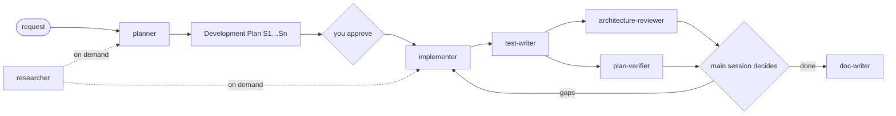

# Agents

Project subagents for DevDigest. Each `<name>.md` is the full definition:
frontmatter (tools, model, skills) plus the prompt. This README is a map of the
set. For exact rules and output templates, open the agent file.

## The set at a glance

| Agent | Responsibility | Tools | Model | Permission mode |
|---|---|---|---|---|
| [`researcher`](researcher.md) | Answers questions with sourced evidence, about this repo or external libraries and APIs | `Read, Grep, Glob, Bash, WebSearch, WebFetch` | `sonnet` | default |
| [`planner`](planner.md) | Turns a request into a Development Plan before any code is written | `Read, Grep, Glob, Bash` | `opus` | default |
| [`implementer`](implementer.md) | Executes an approved plan across `server/`, `reviewer-core/`, `client/` and verifies its own changes | `Read, Grep, Glob, Edit, Write, Bash` | `sonnet` | `acceptEdits` |
| [`test-writer`](test-writer.md) | Writes and runs UI and backend tests in the right tier, including negative tests at trust boundaries | `Read, Grep, Glob, Edit, Write, Bash` | `sonnet` | `acceptEdits` |
| [`architecture-reviewer`](architecture-reviewer.md) | Checks a change against the architectural boundaries, returns evidence-backed findings and PASS/BLOCK | `Read, Grep, Glob, Bash` | `opus` | default |
| [`plan-verifier`](plan-verifier.md) | Verifies the code against every plan and spec item, as a traceability matrix | `Read, Grep, Glob, Bash` | `opus` | default |
| [`doc-writer`](doc-writer.md) | Documents implemented features, turns plans and notes into docs or specs with diagrams, files them in the right section | `Read, Grep, Glob, Edit, Write, Bash` | `sonnet` | `acceptEdits` |

None of them has the `Agent` tool. Only the main session delegates, so there is
no nested spawning.

**What enforces the limits.** `researcher`, `planner`, `architecture-reviewer`
and `plan-verifier` have no `Edit`/`Write` in `tools`, so they cannot write
files through those tools. Everything else is a **prompt rule only**: `Bash`
limited to reading in all of them, `test-writer` writing test files only, and
`doc-writer` writing Markdown docs only. No hook enforces any of these yet.
The security review of implemented code is **not** part of this set.

## How they fit together

The main session drives every hop. Plan steps, report rows and the verifier's
matrix share the ids `S1…Sn`, which makes the handoff checkable. The two
reviewers run in parallel, each in a fresh context, and see the plan and the
diff rather than the implementer's reasoning.

## Inputs and outputs

| Agent | Input | Output | Stops early with |
|---|---|---|---|
| `researcher` | A concrete question, about the repo, external facts, or both | *Repo research* and/or *External research* report: answer, confidence, evidence table (`path:line` or URL), mandatory **Not established** | *Clarification needed*: up to 3 blocking questions |
| `planner` | A feature or change request, optionally a spec from `specs/` | **Development Plan**: goal and acceptance criteria, *Context applied* (INSIGHTS entries), affected modules, steps `S1…Sn` (files, layer, skills, **Done when**), tests by tier, migrations and contracts, out of scope, risks | *Clarification needed*: up to 3 blocking questions |
| `implementer` | An approved Development Plan | **Implementation Report**: status, per-step table, deviations, verification commands with results, not verified, handoff to reviewers, insight candidates | `Status: blocked`: no plan, a step without Files or Done when, or a step it is not allowed to do |
| `test-writer` | The plan's Tests table, an Implementation Report, or named files | **Test Report**: tests written (file, tier, behaviour or trust-boundary, what it proves, result), commands, **production defects found**, not verified, coverage gaps | `Status: blocked`: no target, undecided expected behaviour, or no seam without a production change |
| `architecture-reviewer` | A base ref, or the working tree | **Architecture Review**: PASS/BLOCK, checks run (A1…A9), findings with `file:line` and evidence, downgraded, pre-existing, checks not run | `Status: blocked`: empty diff or unknown base ref |
| `plan-verifier` | An approved plan + a diff source; optionally the spec and the reports | **Plan Verification**: traceability matrix (AC/S/D/T/M/O/SP → met, partial, missing, contradicted or not-verifiable → evidence), gaps, unplanned changes, checks re-run | `Status: blocked`: no plan, no diff source, or empty diff |
| `doc-writer` | A landed feature, or a plan, spec, report or notes | **Documentation Report**: files with Diátaxis type and index row, diagrams, claims not verified, suggested `AGENTS.md` lines | `Status: blocked`: nothing to describe, or a target it may not write |

## Skills

`planner` and `implementer` preload the **same 12 project skills** through the
`skills:` frontmatter. The full `SKILL.md` of each is injected when the agent
starts, so every rule a plan relies on also binds the implementation:

`engineering-insights` · `onion-architecture` · `fastify-best-practices` ·
`drizzle-orm-patterns` · `postgresql-table-design` · `frontend-architecture` ·
`next-best-practices` · `react-best-practices` · `react-testing-library` · `zod` ·
`typescript-expert` · `security`

This costs about 28k tokens of context per spawn. Two skills are not preloaded:
`mermaid-diagram`, which has nothing to do with implementation, and
`pr-self-review`, the pre-PR gate, which the implementer does not run.
`researcher` preloads no skills.

The other four preload only what their job needs:

| Agent | Preloaded skills | Why this set |
|---|---|---|
| `test-writer` | `engineering-insights` · `react-testing-library` · `fastify-best-practices` · `drizzle-orm-patterns` · `onion-architecture` · `zod` · `typescript-expert` · `security` | test idioms per layer. `security` picks the negative cases at trust boundaries. The production-code skills (`next-best-practices`, `react-best-practices`, `frontend-architecture`, `postgresql-table-design`) are left out because it writes no production code |
| `architecture-reviewer` | `engineering-insights` · `onion-architecture` · `frontend-architecture` · `next-best-practices` · `fastify-best-practices` · `zod` · `typescript-expert` | the skills that define boundaries and placement. No `security`: security review is out of its scope |
| `plan-verifier` | `engineering-insights` | the plan is its rulebook. Any other skill (`onion-architecture`, `frontend-architecture`, `typescript-expert`, …) is **read on demand**, only when a plan item names one of its rules as the criterion, and only for that item. Preloading review skills invites generic review in place of the matrix |
| `doc-writer` | `engineering-insights` · `mermaid-diagram` | diagrams. Placement rules come from the `docs/README.md` indexes |

`test-writer` overrides parts of `react-testing-library` with `client/INSIGHTS.md`:
`fireEvent` instead of `userEvent`, which is not installed, and no MSW.

## INSIGHTS.md

All seven agents **read** the root and package `INSIGHTS.md` before working.
None of them **writes** it. They return *Insight candidates*, and the main
session records them during wrap-up with `engineering-insights`, as `CLAUDE.md`
requires. `doc-writer` likewise only *proposes* `AGENTS.md` lines.

## Sources behind the rules

### planner and implementer: external practice

All are primary Anthropic sources, retrieved 2026-09-25 by `researcher`.

| Practice | Applied as | Source |
|---|---|---|
| `description` says **when** to delegate. Behaviour belongs in the body | Trigger-first descriptions that also say what the agent does not do | [Create custom subagents](https://code.claude.com/docs/en/sub-agents) |
| Omitting `tools` inherits everything, including MCP and `Agent` | Explicit allowlists. No `Agent` tool | same |
| `skills:` injects the full `SKILL.md`. Parent skills are not inherited | Same 12 skills preloaded in both agents | same · [Skills](https://code.claude.com/docs/en/skills) |
| Per-agent `permissionMode`. `bypassPermissions` only in a sandbox | `acceptEdits` for implementer | [Permission modes](https://code.claude.com/docs/en/permission-modes) |
| Orchestrator and workers with an explicit handoff | Plan steps `S1…Sn` that the report mirrors | [Building effective agents](https://www.anthropic.com/engineering/building-effective-agents) |
| Workers return a condensed summary, about 1–2k tokens | Size caps: plan about 1,500 words, report about 800. Commands and outcomes, not logs | [Effective context engineering](https://www.anthropic.com/engineering/effective-context-engineering-for-ai-agents) |
| Give the agent a pass/fail check. Review happens in a fresh context, without over-flagging | A runnable *Done when* per step. The implementer verifies but does not review | [Claude Code best practices](https://code.claude.com/docs/en/best-practices) |

**Deliberate deviation:** the [skill authoring guide](https://platform.claude.com/docs/en/agents-and-tools/agent-skills/best-practices)
favours progressive disclosure. Here all skills are preloaded on purpose, so
the implementer cannot skip one. Reference files inside skills are still read
only on demand.

### planner and implementer: repo sources

| Rule | Source |
|---|---|
| Contract-first: `server/src/vendor/shared`, then a targeted hand mirror into `client/`, in one `[Contract]` step | `CLAUDE.md` · root `INSIGHTS.md`, 2026-09-17 entry on the vendored `shared` copies |
| Follow `CLAUDE.md`, not `pr-self-review/routing.md` §4. Do not plan skills that are not installed | root `INSIGHTS.md`, 2026-09-25 entry on `pr-self-review`'s skill map |
| `client/src/vendor/ui/nav.ts` is the only vendor-file exception | `client/INSIGHTS.md`, 2026-09-22 entry on `vendor/ui/nav.ts` |
| `TS2719` in a fixture after a contract change means a missing default key | root `INSIGHTS.md`, *Recurring Errors & Fixes* |
| Migrations via `pnpm db:generate` only. Never `db:migrate`, never hand-written | `CLAUDE.md` · `server/AGENTS.md` |
| Test tier in the filename. `.it` only with Postgres already up | `CLAUDE.md` · `TESTING.md` · `server/AGENTS.md` |
| A `reviewer-core` change also needs `server/` typecheck and tests | `reviewer-core/AGENTS.md`, *Gotchas* |
| Per-package manager and commands | `CLAUDE.md` · each package's `AGENTS.md` |
| Protected paths and excluding `server/clones/**` from searches | `CLAUDE.md` *Do not touch* · root `INSIGHTS.md` |
| *Step 0* clarification and a mandatory *not established* section | modelled on `researcher.md` |
| At most 3 fix attempts per failing check. A skill rule outranks the plan | project decision, with no external source |

### test-writer, architecture-reviewer, plan-verifier, doc-writer: external practice

Retrieved 2026-09-25 by three parallel `researcher` runs. Primary sources unless marked.

| Practice | Applied as | Source |
|---|---|---|
| Verify with a pass/fail signal; show evidence rather than assert success | test-writer runs every file by path; verifier re-runs Done-when | [Claude Code best practices](https://code.claude.com/docs/en/best-practices) |
| Review in a fresh context; report gaps, not preferences; "every requirement implemented, edge cases tested, nothing outside scope changed" | reviewers see plan + diff, not reasoning; verifier's matrix plus *Unplanned changes*; no generic advice | same |
| Read-only via tool allowlist. `Bash` can bypass `Edit`/`Write`-scoped hooks | no `Edit`/`Write` for the two reviewers; the `Bash` limit is a prompt rule, stated as such | [Sub-agents](https://code.claude.com/docs/en/sub-agents) · [Hooks](https://code.claude.com/docs/en/hooks) · [claude-code#29709](https://github.com/anthropics/claude-code/issues/29709) |
| Falsification pass before reporting a finding | skeptic pass on every CRITICAL; refuted → downgraded, never dropped | [claude-code-security-review](https://github.com/anthropics/claude-code-security-review) · `pr-self-review/gate.md` §4 |
| Tool output as architecture evidence, not an LLM reading of imports | `depcruise` output outranks the import walk when its config exists | [dependency-cruiser rules](https://github.com/sverweij/dependency-cruiser/blob/main/doc/rules-reference.md) |
| Judges over-reward surface quality; citations get hallucinated | "tidy code is not evidence"; every `path:line` re-opened and quoted; no evidence, no `met` | [Bias in the Loop](https://arxiv.org/html/2604.16790v1) (preprint) · [LLM-as-a-judge reliability](https://www.adaline.ai/blog/llm-as-a-judge-reliability-bias) (secondary) |
| Traceability: every requirement links to its verification; orphans on both sides | one matrix row per item; *Unplanned changes* for orphaned code | [Requirements traceability](https://en.wikipedia.org/wiki/Requirements_traceability) (secondary, ISO/IEC/IEEE 29148) |
| RTL: query by role/label, test behaviour not implementation | query priority rule; assert on DOM, not internals | [Testing Library queries](https://testing-library.com/docs/queries/about/) · [Testing implementation details](https://kentcdodds.com/blog/testing-implementation-details) |
| Fastify routes tested with `inject()` | `app.inject()` + `close()`, no `listen()` | [Fastify testing guide](https://fastify.dev/docs/latest/Guides/Testing/) |
| Coding agents over-mock and assert on mocks | "assert outcomes, not calls"; mock the outside world only | [Over-mocked tests](https://arxiv.org/pdf/2602.00409) (preprint, MSR'26) · [Mock assertions](https://arxiv.org/pdf/2503.19284) (preprint) |
| One Diátaxis type per document | doc-writer tags each doc; mixed material is split | [Diátaxis](https://diataxis.fr) |
| Docs change with the code; fresh and few beats many and stale | update over add; one doc per topic | [Google docguide best practices](https://google.github.io/styleguide/docguide/best_practices.html) |
| Mermaid renders natively on GitHub; a diagram fails whole past 50k chars | small diagrams, split by level | [GitHub: creating diagrams](https://docs.github.com/en/get-started/writing-on-github/working-with-advanced-formatting/creating-diagrams) · [mermaid-cli#113](https://github.com/mermaid-js/mermaid-cli/issues/113) |
| Agent-facing files: short, imperative, verifiable | doc-writer proposes `AGENTS.md` lines, never prose there | [Claude Code memory](https://code.claude.com/docs/en/memory) · [agents.md](https://agents.md/) |

**Deliberate deviations:** the RTL docs prefer `userEvent`, but it is not
installed in `client/`, so `fireEvent` is used. The research advised dropping
`Bash` from read-only agents. It is kept because `plan-verifier` must re-run
Done-when checks and `architecture-reviewer` needs `rg`, `git diff` and
`depcruise`.

**Not established by the research:** whether Anthropic still recommends
committing tests before the implementation; how `/speckit.analyze` works
internally; Fastify guidance on real-Postgres integration tests (its docs are
silent).

### test-writer, architecture-reviewer, plan-verifier, doc-writer: repo sources

| Rule | Source |
|---|---|
| `fireEvent`, no MSW, `importActual` spread, assert on `messages/en` copy | `client/INSIGHTS.md` · `client/package.json` |
| `MockGitHubClient` lists one PR; mocks from `adapters/mocks.ts` | `server/INSIGHTS.md` · `TESTING.md` |
| Negative tests at trust boundaries, horizontal and vertical | `security/SKILL.md:52` · three 2026-09-22/23 incidents in `server/INSIGHTS.md` |
| Severity scale, closed CRITICAL catalog, skeptic pass | `.claude/skills/pr-self-review/gate.md` §2–4 |
| Known onion `warn` drift is pre-existing, not new | `onion-architecture/SKILL.md` → "Known, honest drift" |
| Vendored-copy sync checked only for touched fields | root `INSIGHTS.md`, 2026-09-17 |
| `depcruise` only when `server/.dependency-cruiser.cjs` exists (absent as of 2026-09-25) | `pr-self-review/gate.md` §1 |
| Docs placement and index rows; `e2e/specs/` is executable; reviewer prompts are DB-synced | `docs/README.md` · `<pkg>/docs/README.md` · `specs/README.md` · `docs/agent-prompts/README.md` |

## Adding or changing an agent

- Keep the `description` short and trigger-focused. Put behaviour in the body.
- Always set `tools` explicitly. Leave out `Agent` unless nesting is intended.
- A new or edited agent is picked up within the session, after a short delay:
  wait for the *new agent types are now available* notice before spawning it.
  See root `INSIGHTS.md`.
- Update this README's tables in the same change.
