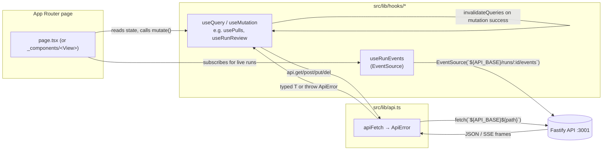

# UI architecture

How `client/` is put together: which routes render on the server vs. the
client, where feature code lives, how data flows from a component to the
Fastify API and back, i18n, styling, and how UI tests are written here. Read
this when adding a route, a hook, or a test and you're not sure where the code
or the assertion belongs. `client/README.md` keeps a one-paragraph route
summary and links here for the detail — this file is the source of truth for
the RSC/client split and the data hooks each route uses.

## 1. App Router route map

Every `page.tsx` under `client/src/app`, whether it (or its first meaningful
child) opens with `"use client"`, and what that implies:

| Route | File | Kind | Notes |
|---|---|---|---|
| `/` | `src/app/page.tsx:1` | client | redirects to the first repo's PR list via `useRepos` (`src/app/page.tsx:9-15`) |
| `/onboarding` | `src/app/onboarding/page.tsx:1` | client | thin wrapper around `_components/AddRepoView` |
| `/repos/:repoId/pulls` | `src/app/repos/[repoId]/pulls/page.tsx:1` | client | PR list; filters/sort in `?status&sort` |
| `/repos/:repoId/pulls/:number` | `src/app/repos/[repoId]/pulls/[number]/page.tsx:1` | client | PR detail; tab in `?tab`, live SSE run status |
| `/repos/:repoId/conventions` | `src/app/repos/[repoId]/conventions/page.tsx:1` | client | dynamic on purpose — the repo id is in the path so a scan is deep-linkable (comment at `page.tsx:1-6`) |
| `/agents` | `src/app/agents/page.tsx:1` | **RSC** page, delegates to a client view | `page.tsx` has no directive; `_components/AgentsListView/AgentsListView.tsx:3` opens `"use client"` |
| `/agents/:id` | `src/app/agents/[id]/page.tsx:4` | client | tab in `?tab`, whitelisted against `VALID_TABS` |
| `/skills` | `src/app/skills/page.tsx:1` | **RSC** page, delegates to a client view | same pattern as `/agents`; `SkillsListView.tsx` is client |
| `/skills/:id` | `src/app/skills/[id]/page.tsx:5` | client, wrapped in `<Suspense>` | comment at `page.tsx:16-18`: `useSearchParams()` forces client rendering, and this route is **static** (no `generateStaticParams`), so `pnpm build` refuses to prerender it without a `Suspense` boundary |
| `/settings/:section` | `src/app/settings/[section]/page.tsx:1` | **RSC** page, delegates to a client view | `SettingsView.tsx:4` opens `"use client"` |

`src/app/layout.tsx:14` (`RootLayout`) is itself a server component — no
`"use client"`, `async function`, calls `getLocale()`/`getMessages()`
server-side (`layout.tsx:15-16`). It renders `<Providers>`
(`src/lib/providers.tsx:2`, `"use client"`) as the single client boundary that
sets up React Query, theme, toasts and the active-repo context.

**The rule for `"use client"`:** a route needs it the moment it (or a
component it renders inline, not through a client child) touches `useState`,
an effect, a router hook (`useParams`/`useRouter`/`useSearchParams`), or one of
the `src/lib/hooks/*` data hooks — all of those hooks open with `"use client"`
themselves (e.g. `src/lib/hooks/core.ts:5`, `src/lib/hooks/reviews.ts:3`).
`/agents`, `/skills` and `/settings/:section` stay server components at the
`page.tsx` level precisely by pushing all of that into a colocated
`_components/<View>` — the pattern each of their thin wrappers describes in
its own comment (e.g. `src/app/agents/page.tsx:3-4`, `src/app/skills/page.tsx:3-4`).

Static routes that read `useSearchParams()` must add a `<Suspense>` boundary or
`pnpm build` fails to prerender them; dynamic (`[param]`) routes with no
`generateStaticParams` are never prerendered so the same code doesn't get
exercised there. See the `2026-09-22` entry indexed in
[`../insights/gotchas.md`](../insights/gotchas.md) for the exact failure mode —
`/skills/[id]/page.tsx:16-18` is the one route here that carries the guard.

## 2. Code placement

Three places, in order of how often you'll use them:

- **Route-private, `_components/<Name>/`** — feature UI used by exactly one
  route. `<Name>` is `PascalCase` (`AgentCard/`, `FindingCard/`,
  `RunReviewDropdown/`). Inside: `<Name>.tsx`, `<Name>.test.tsx`, `index.ts`
  (a barrel re-exporting the component, e.g.
  `src/app/repos/[repoId]/pulls/[number]/_components/FindingCard/index.ts:1`),
  plus lowercase `styles.ts` / `helpers.ts` / `constants.ts` as needed —
  confirmed against `FindingCard/` (`FindingCard.tsx`, `FindingCard.test.tsx`,
  `helpers.ts`, `index.ts`, `styles.ts`) and `AgentEditor/`
  (`AgentEditor.tsx`, `AgentEditor.test.tsx`, `constants.ts`, `index.ts`,
  `styles.ts`, plus its own `_components/` for sub-tabs). This matches
  `client/AGENTS.md`'s "Two folder cases" convention.
- **Shared chrome, `src/components/<kebab-case>/`** — used across routes:
  `app-shell/`, `confirm-modal/`, `diff-viewer/`, `findings-preview/`,
  `mermaid-diagram/`, `page-shell/`, `repo-not-found/`, `run-cost-badge/`,
  `severity-counter/`, `showcase/` (`ls src/components`). Same internal layout
  as above, `kebab-case` directory name instead of `PascalCase`.
- **`src/lib/`** — no UI: `api.ts` (fetch layer), `hooks/*` (data hooks),
  `theme.tsx`, `providers.tsx`, `repo-context.tsx`, `severity.ts`,
  `feature-models.ts`, `toast.tsx`, `types.ts`.
- **`src/vendor/ui` is off-limits**, per `client/AGENTS.md`'s Gotchas — it's
  the vendored `@devdigest/ui` design system, refreshed wholesale from
  upstream. The one recorded, signed-off exception is
  `src/vendor/ui/nav.ts`, where the `conventions` entry
  (`nav.ts:41`, comment at `nav.ts:38-40`) was hand-added because there is no
  other seam to add a sidebar item — see the full write-up in
  `client/INSIGHTS.md` (`2026-09-22 — vendor/ui/nav.ts is the one vendored
  file we edit…`, indexed in [`../insights/gotchas.md`](../insights/gotchas.md)).
  Treat that line as disposable: the next vendor refresh overwrites `nav.ts`
  and silently drops it.

## 3. Data layer

**`src/lib/api.ts`** is the only place that calls `fetch`. `apiFetch<T>`
(`api.ts:21`) prefixes every path with `API_BASE`
(`NEXT_PUBLIC_API_BASE`, default `http://localhost:3001`, `api.ts:5-6`), only
sets a JSON content-type header when a body is present (`api.ts:26-32`,
because an empty-body POST like `refresh` or `reindex` would otherwise trip
Fastify's "Body cannot be empty" check), and normalizes both network failures
and non-2xx responses into `ApiError` (`api.ts:8-19`, `34-58`) — `status: 0`
for a network failure, the server's status/code/message otherwise. `api`
(`api.ts:65-74`) wraps `apiFetch` into `get`/`post`/`put`/`patch`/`del`.

**Hooks** live one file per feature domain under `src/lib/hooks/`: `core.ts`
(settings, secrets, repos, pulls, project context), `agents.ts`, `skills.ts`,
`reviews.ts`, `trace.ts`, `repo-intel.ts`, and `conventions.ts`. The barrel
`src/lib/hooks/index.ts:4-9` re-exports `core`, `agents`, `skills`, `reviews`,
`trace`, `repo-intel` — **`conventions.ts` is not in the barrel**; its
consumer imports it directly (`src/app/repos/[repoId]/conventions/page.tsx`
imports from `@/lib/hooks/conventions`). Every hook file opens with
`"use client"` (e.g. `core.ts:5`) since TanStack Query hooks need the client
runtime.

Each hook wraps one endpoint in `useQuery`/`useMutation` with a `queryKey`
array; the pattern for invalidation after a mutation is consistent throughout:
a mutation invalidates the list/detail keys it can affect. Examples actually
read from the code:

- `useAddRepo` invalidates `["repos"]` (`core.ts:74-80`); `useRefreshRepo`
  invalidates both `["repos"]` and `["pulls", repoId]` (`core.ts:82-91`).
- `useTestConnection` invalidates `["provider-models"]` and
  `["secrets-status"]` only on a successful key test (`core.ts:38-55`) — a
  provider key change can change which models resolve.
- `useRunReview` invalidates `["reviews", prId]` on success (`reviews.ts:124-136`).
- `useFindingAction` (accept/dismiss) invalidates `["reviews", prId]`
  (`reviews.ts:139-161`).
- `useDeleteRun` invalidates both `["pr-runs", prId]` and `["reviews", prId]`
  (`reviews.ts:60-71`) because deleting a run also deletes the review it
  produced, server-side.
- `useDeleteSkill` invalidates `["skills"]`, removes the cached `["skill", id]`
  entry, and also invalidates `["agent-skills"]` (`skills.ts:73-83`) since a
  deleted skill can no longer appear in any agent's skill list.

**Polling vs. push.** `usePulls` (`core.ts:102-112`) refetches every 60s and on
window focus to keep PR status roughly current. `usePrActiveRuns`
(`reviews.ts:28-35`) and `usePrRuns` (`reviews.ts:40-48`) poll every 4s only
while at least one run is `running`, so they self-clear.

**SSE for live runs.** `useRunEvents(runIds)` (`reviews.ts:168-216`) opens one
`EventSource` per run id at `${API_BASE}/runs/${runId}/events`, listens both to
the default `message` event and to named events `info`/`tool`/`result`/`error`
(`reviews.ts:194-199`, because the server emits both), accumulates parsed
`RunEvent`s into local React state, and surfaces a runtime `error` event as a
toast directly (`reviews.ts:186-189`) since the SSE channel is outside React
Query's own error handling. The stream closes itself (`es.onerror` /
`open <= 0`, `reviews.ts:200-204`) and all sources are closed on unmount /
`runIds` change (`reviews.ts:208-211`). `useRunTrace` (`trace.ts:12-19`) is the
non-live counterpart: one `GET /runs/:id/trace` fetch for the persisted,
already-finished document.

Global error surfacing sits in `src/lib/providers.tsx:35-43`: the shared
`QueryClient`'s `queryCache`/`mutationCache` toast on any mutation error, and
on a query error only for network failures or 5xx — an expected 4xx (e.g. "no
tour yet") is left for the component's own empty/error state.

## 4. i18n

`next-intl` is wired through `next.config.mjs` (`createNextIntlPlugin`) and
`src/i18n/request.ts`. There's a single locale, `en` (`request.ts:14`), no
locale routing. `loadMessages` (`request.ts:16-25`) reads every `*.json` file
in `messages/<locale>/` and merges them keyed by filename-as-namespace, so
`messages/en/agents.json` becomes the `"agents"` namespace. Components read a
namespace with `useTranslations("<ns>")` client-side or `getTranslations` on
the server (comment at `request.ts:9-12`).

**Distinct keys per UI state.** The convention, per
`client/AGENTS.md` ("User-facing strings come from `next-intl`… don't hardcode
copy in JSX") and confirmed by an indexed gotcha, is one key per meaning even
when two states currently render identical English text — see
[`../insights/gotchas.md`](../insights/gotchas.md) for the
`ContextTab` example (`context.noRepo` / `context.noDocs` / `context.empty`)
where merging keys made an RTL `getByText` failure look like a broken query
when it was actually two different user states sharing one string.

## 5. Styling and theme

There is no CSS-in-JS library: each component folder that needs styling ships
a `styles.ts` exporting plain `CSSProperties` objects/factories (e.g.
`.../FindingCard/styles.ts`, `.../pulls/styles.ts` — imported as `s` in
`src/app/repos/[repoId]/pulls/page.tsx:19` via `import { s } from "./styles"`).

Theme is a `data-theme` attribute on `<html>`, toggled dark/light.
`src/lib/theme.tsx` defines `ThemeProvider`/`useTheme` (`theme.tsx:13-41`,
`"use client"` at `theme.tsx:2`) and `themeNoFlashScript`
(`theme.tsx:44`), an inline script injected in `<head>` by
`src/app/layout.tsx:21` so the theme is set from `localStorage` before first
paint (no flash of the wrong theme). `ThemeProvider` is one of the providers
mounted by `src/lib/providers.tsx:48`.

Visual primitives come from `@devdigest/ui` (vendored at `src/vendor/ui`,
aliased in `tsconfig.json`), themed through CSS variables in its
`styles.css`, imported once at the app root
(`src/vendor/ui/README.md:1-13`). Components import everything from the single
barrel — `import { Button, Card, … } from "@devdigest/ui"` — never a layer
file directly, per that package's own README.

## 6. UI testing

Component tests are `*.test.tsx` beside the component they test, run under
vitest + jsdom (`client/AGENTS.md`, `pnpm test`). Two conventions are load
-bearing here and each has a fuller write-up in `client/INSIGHTS.md`, indexed
in [`../insights/gotchas.md`](../insights/gotchas.md):

- **`fireEvent`, not `user-event`.** `@testing-library/user-event` is not a
  dependency (`client/package.json` has no such entry); every interaction test
  drives events synchronously with `fireEvent` — see
  `.../RunReviewDropdown/RunReviewDropdown.test.tsx` for the pattern: `render`
  wrapped in `NextIntlClientProvider` with the relevant `messages/en/*.json`
  namespace (`RunReviewDropdown.test.tsx:20-26`), `next/navigation` and the
  data hooks it needs mocked with `vi.mock` (`RunReviewDropdown.test.tsx:6-14`).
- **Mocking a hooks barrel needs `importActual`.** `vi.mock("path/to/barrel",
  () => ({ oneHook: … }))` replaces the *entire* module, so any sibling
  component rendered in the same tree that imports a different hook from that
  same barrel gets `undefined` at render — not a mock error, a crash inside an
  unrelated child. Spread the real module first:
  `vi.mock(path, async (importActual) => ({ ...(await importActual()), useX:
  … }))`. Full incident: `../insights/gotchas.md` (Tests section) linking
  `client/INSIGHTS.md`'s `2026-09-23` entry.

## 7. Page → hooks → api → server

