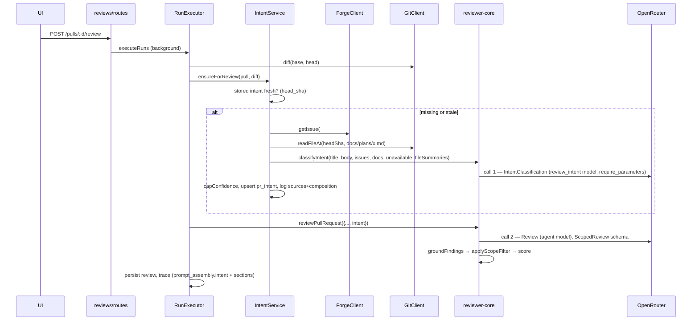

# Development Plan: Intent Layer — PR intent classifier, persistence, review injection, Intent card
Status: done
Save as: docs/plans/01-intent-layer.md
Spec: specs/006-intent-layer.md

## Goal & acceptance criteria
A separate call to a cheap model classifies each PR's intent from its title, description, linked issue, linked plan/spec and changed-file hunk headers. The result is stored per PR together with the head SHA it was computed at. The structured intent goes into the main reviewer prompt, where it filters out-of-scope findings without loosening grounding. An Intent card on the PR Overview shows the result, and every source and prompt composition is logged without secrets or diff content.

- AC1: The Overview tab renders an Intent card above the description. It shows the quoted summary, IN SCOPE (check icons) and OUT OF SCOPE (x icons), a confidence badge, the sources list and a missing-context warning. It has a Re-classify button, which shows a stale badge when `pr.head_sha` ≠ the intent's `head_sha`. There is distinct i18n copy for four states: no intent yet, low confidence (indirect data only), linked source unreachable, and classify error.
- AC2: The classifier uses the `review_intent` feature model (default per D2: `deepseek/deepseek-v4-flash`; provider `openrouter`), resolved separately from the agent's model. Settings → Models lists it and saves an override, and the classifier uses that override.
- AC3: The classifier request contains file paths and numeric `@@ -a,b +c,d @@` headers only, never hunk bodies. The .it test asserts the `IntentClassification` call's messages contain `src/config.ts` and `@@ -10,3 +10,4 @@` but not `stripeKey` or `sk_live_xxx`, which are the `MockGitClient` diff body.
- AC4: A plan/spec path or same-repo blob URL in the PR body is read at the PR head SHA. It appears in `sources` with `status: ok` and inside the classifier prompt's `linked-doc` section. If it is unreachable, it gets `status: failed`, a `missing_context[]` entry and confidence ≤ `medium`. It is never dropped silently.
- AC5: Issue references (closing keywords, `#N`, `owner/repo#N` on the same forge host, full issue URLs on that host) are fetched through `ForgeClient.getIssue`. Each is recorded as a source with its ok/failed status.
- AC6: With an empty description and no linked sources, the classifier runs on title + file list + headers, and the stored confidence is `low`.
- AC7: `GET /pulls/:id/intent` returns the record with `stale: true` and `stale_reason: 'head_moved'` after the PR head moves, and `stale: true` with `stale_reason: 'description_changed'` after the stored PR title or description changes with the same head (when both changed, `head_moved` wins). A review run re-classifies in either case (D4-A). `POST /pulls/:id/intent/classify` recomputes it and stores the new `head_sha` and `description_hash`.
- AC8: With an intent present, the reviewer prompt contains a `## PR intent` untrusted block. Non-serious findings the model flags `out_of_scope` are removed. Serious ones (CRITICAL or `security`) leave exactly one finding (per D6). A finding that fails grounding is still dropped, with or without intent.
- AC9: Two separate LLM calls are visible. In a review run the run log has a classifier step line (model, tokens, cost) before the agent's review, and `MockLLMProvider.calls` holds an `IntentClassification` call and a `Review` call.
- AC10: The pino log and the stored `composition` record the prompt sections (name, chars, tokens), the model and provider, and the sources (kind, redacted ref, status). They contain no `Authorization`, token or URL query strings, and no diff or doc content. An .it test captures the logger and asserts this.
- AC11 (process item): `.claude/agents/{planner,researcher,architecture-reviewer,plan-verifier}.md` have `tools: Read, Grep, Glob, Bash` (researcher adds `WebSearch, WebFetch`), with no `Edit`/`Write`. The verifier cites these lines.
- AC12: A review with no OpenRouter key still completes. The intent step logs "intent unavailable" and the prompt is identical to today's. Existing `reviews.it.test.ts` and `skills-in-prompt.it.test.ts` stay green.

## Decisions needed
| # | Decision | Options | Recommendation | Steps affected |
|---|---|---|---|---|
| D1 | Spec first? | A: `doc-writer` writes `specs/006-intent-layer.md` from this Goal/AC before approval; `Spec:` updated · B: plan stands alone | A — `specs/README.md` gives cross-package features a spec; the verifier then has a "what" to check against | header only |
| D2 | Default classifier model | A: `openrouter` / `google/gemini-2.5-flash-lite` · B: `openrouter` / `deepseek/deepseek-v4-flash` | A — every endpoint supports structured outputs; `require_parameters: true` is sent either way. **Chosen: B** | S1, S13 |
| D3 | Fetch non-forge links (Jira/Linear/Notion/any URL)? | A: not fetched; source `status: unsupported` + `missing_context` · B: add an SSRF-guarded fetcher adapter | A — no new outbound surface in v1 | S9, S10 |
| D4 | When classification runs | A: in review pre-work when intent is missing **or** stale, plus manual Re-classify · B: manual only · C: auto only when missing | A — injection needs a current intent; runs once per review, shared by all agents | S12 |
| D5 | Classifier observability row | A: no `agent_runs` row; tokens/cost/model/composition stored on `pr_intent` and as step lines in each review run's log/trace · B: its own `agent_runs` row (`agent_id` null) + `run_traces` | A — `agent_runs` feeds the timeline, stats and cost rollups per agent; a null-agent row is a new case for all of them. Cost: the classifier's cost is excluded from the PR cost rollup | S6, S10, S12 |
| D6 | Out-of-scope filter mode | A: drop non-serious OOS; collapse serious OOS into ONE kept finding (most severe), rationale gets "+N more out-of-scope serious findings suppressed" · B: keep every serious OOS finding, drop non-serious · C: demote OOS to SUGGESTION instead of dropping | A — matches "one signal" literally; B is the more conservative security choice | S5 |
| D7 | Cross-repo issue refs `owner/repo#N` | A: allowed on the same forge host only (token never leaves the forge host) · B: same repo only | A | S9 |

### Decisions recorded (user, 2026-09-26)
| # | Choice | Consequence for the plan |
|---|---|---|
| D1 | **A** — spec first | `doc-writer` writes `specs/006-intent-layer.md` from Goal/AC before approval; then `Spec:` is updated to that path. |
| D2 | **B** — `openrouter` / `deepseek/deepseek-v4-flash` | S1 `platform.ts` and S13 `client/src/lib/feature-models.ts` use this default (same as `onboarding`). `requireParameters: true` is **mandatory** for this model: several of its OpenRouter endpoints (e.g. Relace, GMICloud) lack structured outputs, so routing must exclude them; the cheapest endpoint is therefore not used. S2's test is the guard for this. |
| D3 | **A** — non-forge links are not fetched | recorded as `status: unsupported` + `missing_context`; no fetcher adapter. |
| D4 | **A** — auto in review pre-work when missing or stale, plus manual Re-classify | S12 as written. |
| D5 | **A** — no `agent_runs` row | classifier tokens/cost/model/composition live on `pr_intent` and in the review run's log/trace; its cost is not in the PR cost rollup. |
| D6 | **A** — drop non-serious OOS; collapse serious OOS into one kept finding | S5 as written. |
| D7 | **A** — `owner/repo#N` only on the same forge host | S9 as written. |

**Correction (user, 2026-09-26):** staleness also tracks a hash of the PR title + description, not only `head_sha` — AC7, S1, S6, S9, S10, S11, S12, S14 and Risks amended.

~~Implementation is **not** started: the user asked to hold (2026-09-26).~~ Superseded below.

**Approval (user, 2026-09-26):** explicit go-ahead — "Почни реалізацію Intent Layer за погодженим планом". Spec D1 exists (`specs/006-intent-layer.md`). Status `approved` → `in-progress`.

**Iteration-1 scope decision (user, 2026-09-26): no tests are added in this iteration.**
- Do **not** create any test file listed in the steps or the *Tests* table (`openrouter.test.ts`, `intent-classify.test.ts`, `scope-filter.test.ts`, `intent-helpers.test.ts`, `intent.it.test.ts`, `intent-review.it.test.ts`, `IntentCard.test.tsx`) and do **not** add new test cases to existing test files (`prompt.test.ts`, `run.test.ts`, `adapters.test.ts`).
- Allowed: the minimum edit to an *existing* test fixture/mock that a contract or port change forces for typecheck to stay green (e.g. a new key in a fixture factory's defaults — root INSIGHTS TS2719; a new mock method). No new assertions.
- Each step's *Done when* is therefore met by: the package typecheck + the **existing** test suites staying green, plus the non-test commands in it (e.g. `pnpm db:generate` output, `rg` checks). The test-based parts of *Done when* and the *Tests* table are **deferred** to a later iteration (`test-writer`), and the plan-verifier reports them as `deferred (user)`, not as gaps.
**Fix R1 (user, 2026-09-26) — overall time budget for intent in review pre-work.** Found by the main session while verifying G5: `.it` tests do not override `secretsPath`, so `container.llm('openrouter')` read the developer's `~/.devdigest/secrets.json`, built a real `OpenRouterProvider` (90 s timeout × up to 3 attempts, `reviewer-core/src/llm/openrouter.ts:55-56`) and the review run stalled — `reviews.it`/`skills-in-prompt.it` 4/16 failed; with a temp `HOME` 16/16 pass. User chose **A**: `IntentService.ensureForReview` (S10, `server/src/modules/intent/service.ts`) wraps the whole resolution in one overall budget (`INTENT_REVIEW_BUDGET_MS = 20_000` in `modules/intent/constants.ts`, via the existing `withTimeout`); on expiry it logs "intent unavailable — reviewing without it" and returns `undefined`. The manual `classify` route is not bounded by it. Option B (isolating `.it` tests from developer secrets) is **deferred** with the other test work; until then the main session runs the `.it` suite with a temporary `HOME`.
**Fix round 2 (user, 2026-09-26): "fix everything found and write the deferred tests".** Findings from architecture-reviewer (F1–F3) and plan-verifier were shown with evidence first. Ids for fix mode:
- **V1** (AC4, S9) `helpers.ts` blob-URL branch ignores owner/name — a same-host blob of another repo is read as a path of this repo. Must match `<owner>/<name>` (GitLab: full group path) of the forge repo, else `external`.
- **V2** (AC9, S12) classifier model, tokens in/out, cost and sources ok/failed must be in the run-log **message text** (`RunLogger.logFor` persists only `{t,kind,msg}`, `run-logger.ts:95`); `data` stays for pino. Files: `service.ts`.
- **V3** `IntentRepository.upsert` must refresh `classified_at` on conflict (`repository.ts:92`).
- **V4** `DOC_PATH_RE` (`constants.ts:23`) must match only a path that starts the token (not `server/docs/x.md` → `docs/x.md`).
- **V5** stale comment naming `upsertIntent`/`getIntent` (`intent/repository.ts:43`).
- **V6** (S9/S10) `unsupported` external links count as failed linked sources for `capConfidence` → confidence ≤ medium (user confirmed reading of S9).
- **V7** GitLab nested-group issue URLs: owner/name split must use the whole group path, not the first two segments (`helpers.ts`).
- **V8** (AC1, S14) Intent card: a failed `GET /pulls/:id/intent` gets its own state and copy (`loadError`), distinct from "not classified yet". Files: `IntentCard/*`, `brief.json`.
- **V9** (S10) `sources` also records `pr_title` (ok), `pr_description` (ok / absent) and `file_list` (ok, count) so the card and logs show every input kind the enum defines.
- **F3** `intent/routes.ts` uses `app.container.intent` instead of `new IntentService(...)`.
- **V10** (user, 2026-09-26) owner/name comparison in `extractIntentLinks` (V1 blob-URL check, and any other same-repo check in `helpers.ts`) is **case-insensitive** — GitHub and GitLab route owner/repo paths case-insensitively, so `github.com/Acme/Repo/blob/…` on repo `acme/repo` is a linked doc, not external. The host check stays as is (hosts are already lower-cased by `URL`). Test: a mixed-case blob URL of this repo → `linked_doc`; a different owner in any case → `external`.
- **F1 + F2 — plan change, not fix mode:** removing the cross-module imports from `intent/service.ts` and the `container ↔ IntentService` cycle needs files outside every step (`repos/*`, `settings/*`, other importers). Sent to the planner; the plan returns to `draft` for those steps only after the user sees the change.
- **Deferred tests now in scope** (reverses the Iteration-1 decision for tests): `test-writer` writes the *Tests* table T1–T9, the test parts of AC3/AC10 and every Done-when test, plus tests for V1–V9, and **Option B** — `.it` tests isolated from the developer's `~/.devdigest/secrets.json` (temp `secretsPath` / openrouter mock in the shared helpers) with helper waits sized above `INTENT_REVIEW_BUDGET_MS`.
- ~~**Not changed (accepted in Fix R1):** a timed-out background classification may still upsert later.~~ **Reversed (user, 2026-09-26):** superseded by S16 (change A, draft).
**Closure (user, 2026-09-26): "будемо вважати усе виконаним".** Final verification: architecture-reviewer **PASS**, no findings (F1–F3 closed); plan-verifier **incomplete** — 137 met · 9 partial · 0 missing · 0 contradicted · 3 not-verifiable of 149. Final main-session run (normal HOME): reviewer-core 54/54, server unit 351/351, `.it` 106/106, client 320/320; typecheck + build green in all packages. The user accepted the remaining items **as-is, not fixed**:
- **P16d** — after an abort, a signal-ignoring LLM that resolves late can still emit the "intent: prompt composition" log (`service.ts:330`; next checkpoint only at `:375` before `upsert`). No late write to the DB.
- **Test gaps:** D9 (only `Closes`/`Implements` keywords tested), D12/T8 (`intent-review.it` doesn't assert the `Review` call and its order), T3 (no cap assertions), V6 (no external-link → medium test), V7 (nested-group test only for blob URLs, not issue URLs).
- **Option B, partial:** `isolatedTestConfig` isolates `secretsPath` but `LocalSecretsProvider` still falls back to `process.env` — an exported `OPENROUTER_API_KEY` (shell/CI) makes `.it` tests call OpenRouter; helper waits (10 s / 15 s) stay below the 20 s budget.
- **Sign-off items:** LV1 (live run with a real OpenRouter key — not performed), R3 (plan file untracked, no baseline), R4 (break-check proof table not passed to the verifier; test-writer reported checksum-verified reverts).
- Minor: `IntentCard` ignores its `prHeadSha` prop; the issue-URL regex also passes `merge_requests/N` to `getIssue`; the composition log's `tokens=` is in+out, not the section total.
- Reviewer findings (architecture-reviewer, plan-verifier) are shown to the user with evidence **before** any fix-mode run; nothing is fixed automatically.

## Prerequisites
- Postgres up for `.it` tests (`./scripts/dev.sh` or testcontainers).
- No new dependencies.

## Step groups
| Group | Steps | Package / layer | Runs after | Handoff to the next group |
|---|---|---|---|---|
| G1 | S1 | shared contracts + client mirror | — | New exports: `IntentConfidence`, `IntentSourceKind`, `IntentSourceStatus`, `IntentSource`, `MissingContext`, `IntentClassification`, `PromptSection`, `PrIntentRecord` (extended), `PrIntentResponse`; `StructuredRequest.requireParameters`; `GitClient.readFileAt` |
| G2 | S2–S5 | reviewer-core | G1 | Exports: `buildIntentPrompt`, `classifyIntent`, `fileSummariesFromDiff`, `applyScopeFilter`, `ScopedReview`; `ReviewInput.intent`, `ReviewInput.countTokens`; `ReviewOutcome.assembly.intent/sections` |
| G3 | S6–S8 | server schema, git adapter, intent repository | G1 (may run parallel to G2 and G6) | `pr_intent` new columns + migration; `MockGitClient.readFileAt` with `opts.filesAt`; `IntentRepository` |
| G4 | S9–S10 | server intent helpers + service | G2, G3 | `IntentService.classify(workspaceId, prId, opts)`, `.get(...)`, `.ensureForReview(...)` |
| G5 | S11–S12 | server routes, DI, run-executor + .it tests | G4 | `GET /pulls/:id/intent`, `POST /pulls/:id/intent/classify` |
| G6 | S13–S14 | client | G1 (API shape from S1; may run parallel to G2–G5) | — |

G2, G3 and G6 share no files.

## Steps

### S1 — Extend intent, trace and port contracts; mirror to client  [Contract]
- **Files:** `server/src/vendor/shared/contracts/brief.ts`, `contracts/trace.ts`, `contracts/review-api.ts`, `contracts/platform.ts`, `adapters.ts` (modify); the same five under `client/src/vendor/shared/` (modify, targeted mirror)
- **Change:**
  - `brief.ts`:
    - `IntentConfidence = z.enum(['high','medium','low'])`.
    - `IntentSourceKind = z.enum(['pr_title','pr_description','linked_issue','linked_doc','external_link','file_list'])`.
    - `IntentSourceStatus = z.enum(['ok','failed','unsupported'])`.
    - `IntentSource = {kind, ref: string, status, reason: string.nullish(), chars: int.nullish()}`.
    - `MissingContext = {kind, ref, reason: string}`.
    - `IntentClassification = Intent.extend({confidence: IntentConfidence})`.
    - `Intent` itself is unchanged.
  - `trace.ts`:
    - `PromptSection = {name, chars: int, tokens: int, tokens_source: z.enum(['tokenizer','estimate'])}`.
    - `PromptAssembly` gains `intent: z.string().nullish()` and `sections: z.array(PromptSection).nullish()`.
  - `review-api.ts`:
    - `PrIntentRecord = IntentClassification.extend({pr_id, head_sha: string.nullable(), description_hash: string.nullable(), stale: boolean, stale_reason: z.enum(['head_moved','description_changed']).nullable(), provider: string.nullable(), model: string.nullable(), sources: IntentSource[], missing_context: MissingContext[], composition: PromptSection[], tokens_in/out: int.nullable(), cost_usd: number.nullable(), cost_source: CostSource.nullable(), classified_at: string})`.
    - `PrIntentResponse = {intent: PrIntentRecord.nullable(), pr_head_sha: string}`.
  - `platform.ts`: `review_intent` → `defaultProvider:'openrouter'`, `defaultModel` per D2, description "Cheap model that classifies a PR's intent and scope before review."
  - `adapters.ts`:
    - `StructuredRequest.requireParameters?: boolean` (doc: OpenRouter `provider.require_parameters`; other providers ignore it).
    - `GitClient.readFileAt(repo: RepoRef, ref: string, path: string): Promise<string>`.
- **Layer / why here:** contracts change in `server/src/vendor/shared` first (CLAUDE.md), then a targeted mirror.
- **Skills to apply:** `zod`, `typescript-expert`, `onion-architecture`
- **Practices:**
  - New optional trace fields are `.nullish()`, so old traces still parse.
  - Types come from `z.infer`; schemas and types are both exported.
  - The port has no vendor name in `readFileAt`.
  - The client mirror is edited hunk by hunk, never `cp`. Check each mirrored file with a scoped `diff` of the edited symbol.
- **Known gotchas:**
  - Root INSIGHTS "the two vendored shared copies are not actually in sync" — client `adapters.ts` lacks `sessionId`; mirror only the new lines.
  - Root "TS2719 … after adding a contract field" — add new keys to fixture defaults.
- **Done when:** `cd server && pnpm typecheck` passes (expect `MockGitClient`/`SimpleGitClient` errors for `readFileAt` — fixed in S7; if the implementer must keep this green, add stub bodies in S7's files within G1: allowed, same owned paths) · `cd client && pnpm typecheck` · `cd reviewer-core && npm run typecheck`

### S2 — OpenRouter: send `provider.require_parameters` when requested
- **Files:** `reviewer-core/src/llm/openrouter.ts` (modify); `reviewer-core/test/openrouter.test.ts` (create)
- **Change:** in `completeStructured`, when `this.id === 'openrouter' && req.requireParameters`, spread `{ provider: { require_parameters: true } }` into the create body.
- **Layer / why here:** the provider is owned by reviewer-core (`openrouter.ts:13-24`).
- **Skills to apply:** `typescript-expert`, `onion-architecture`
- **Practices:**
  - No new `fetch` or I/O.
  - The test uses `vi.mock('openai')` to capture the create body.
- **Known gotchas:** reviewer-core "the only I/O allowed … is the fetch in listModels" → [link](../../reviewer-core/INSIGHTS.md#2026-09-26--fetch-in-srcllmopenrouterts-is-the-one-allowed-io-an-import-only-purity-check-misses-it)
- **Done when:** `cd reviewer-core && npm test` — `openrouter.test.ts` asserts `provider.require_parameters === true` when the flag is set and absent otherwise.

### S3 — Reviewer prompt: intent slot, scope rule, section composition
- **Files:** `reviewer-core/src/prompt.ts` (modify); `reviewer-core/test/prompt.test.ts` (modify)
- **Change:**
  - `PromptParts.intent?: Intent`, rendered after `## PR description` as `## PR intent (derived, untrusted)` + `wrapUntrusted('intent', <intent / in_scope / out_of_scope as bullet text>)`.
  - When `intent` is present, append a trusted `SCOPE_RULE` to the user sections: "set `out_of_scope: true` only when a finding concerns work listed out of scope or outside every in-scope item; never lower severity for scope".
  - `assemblePrompt(parts, opts?: { countTokens?: (s: string) => number })` returns `assembly.sections: PromptSection[]` (system, task, pr_description, intent, skills, memory, repo_map, specs, callers, diff). Tokens come from `countTokens`, else `Math.ceil(chars/4)` with `tokens_source: 'estimate'`.
  - `assembly.intent` = the rendered intent text.
  - Without `intent`, the output is byte-identical to today's except for the new `sections` key.
- **Layer / why here:** pure prompt assembly lives in reviewer-core.
- **Skills to apply:** `onion-architecture`, `typescript-expert`, `security`
- **Practices:**
  - Intent is wrapped untrusted.
  - `INJECTION_GUARD` is unchanged.
  - The token counter is injected, not imported.
- **Known gotchas:** none
- **Done when:** `prompt.test.ts` asserts:
  - the intent block is inside `<untrusted source="intent">`;
  - the `</untrusted>` escape works;
  - there is no intent section and no `SCOPE_RULE` when `intent` is undefined;
  - `sections` names and chars match.

### S4 — Intent classifier prompt + call (pure)
- **Files:** `reviewer-core/src/intent/classify.ts` (create), `reviewer-core/src/intent/file-summaries.ts` (create), `reviewer-core/src/index.ts` (modify); `reviewer-core/test/intent-classify.test.ts` (create)
- **Change:**
  - `fileSummariesFromDiff(diff: UnifiedDiff): FileSummary[]` → `{path, additions, deletions, headers: string[]}`. Headers are rebuilt from `DiffHunk` numbers as `@@ -oldStart,oldLines +newStart,newLines @@`. `diff.raw` is never read.
  - `buildIntentPrompt(input: IntentPromptInput, opts?)` → `{messages, sections}`. Input is `{title, description?, issues: {ref, title, body}[], docs: {ref, content}[], unavailable: {kind, ref, reason}[], files: FileSummary[]}`.
    - The system prompt has classification instructions plus `INJECTION_GUARD`, and tells the model: "if a listed source is unavailable, say so; never invent its content; lower confidence".
    - Sections: `pr_title`, `pr_description`, `linked_issue`, `linked_doc`, `unavailable_sources`, `file_list`.
    - Every untrusted block goes through `wrapUntrusted`.
    - Caps (assumption): description 4000 chars; issue body 4000; doc 6000 each; ≤3 issues, ≤3 docs; ≤150 files; ≤12 headers per file.
  - `classifyIntent({llm, model, input, sessionId?, countTokens?})` calls `llm.completeStructured({schema: IntentClassification, schemaName: 'IntentClassification', requireParameters: true, temperature: 0, maxRetries: 1})` and returns `{data, sections, tokensIn, tokensOut, costUsd, costSource, model}`.
  - Export all of these from `index.ts`.
- **Layer / why here:** prompt building and schema-validated output are pure (reviewer-core AGENTS). Fetching stays in server.
- **Skills to apply:** `onion-architecture`, `zod`, `security`, `typescript-expert`
- **Practices:**
  - No imports of fs, db or github.
  - Output is validated by Zod via the provider.
  - Caps are module constants.
- **Known gotchas:** reviewer-core purity item (grep `\bfetch\(` and `process\.env` after the change).
- **Done when:** `intent-classify.test.ts` asserts:
  - with a diff whose body contains `SECRET_BODY_LINE`, the messages contain the path and the `@@` header but not `SECRET_BODY_LINE`;
  - empty description → no `pr_description` section;
  - an unavailable source appears in `unavailable_sources`;
  - the `MockLLM`-style stub receives `requireParameters: true`.

### S5 — Out-of-scope filter wired after grounding
- **Files:** `reviewer-core/src/review/scope.ts` (create), `reviewer-core/src/review/run.ts` (modify), `reviewer-core/src/index.ts` (modify); `reviewer-core/test/scope-filter.test.ts` (create), `reviewer-core/test/run.test.ts` (modify)
- **Change:**
  - `ScopedFinding = Finding.extend({ out_of_scope: z.boolean().nullish() })`; `ScopedReview = Review.extend({ findings: z.array(ScopedFinding) })`.
  - `applyScopeFilter(findings)` → `{kept, dropped: {finding, reason: 'out of scope'}[]}`, per D6. "Serious" means `severity === 'CRITICAL' || category === 'security'`. The kept serious one gets its title prefixed `Out of scope: ` (assumption). `out_of_scope` is stripped from output.
  - `ReviewInput` gains `intent?: Intent` and `countTokens?`. When `intent` is set, pass it to `assemblePrompt` and use `ScopedReview`/`'Review'` as the schema. After `groundFindings`, run `applyScopeFilter(ground.kept)`, emit one `info` event per dropped finding, then compute the score from the filtered set.
  - Without `intent`, the path is unchanged (CI runner unaffected).
- **Layer / why here:** engine logic; the filter runs only on grounding survivors.
- **Skills to apply:** `onion-architecture`, `zod`, `typescript-expert`
- **Practices:**
  - `groundFindings` is untouched and runs first.
  - The filter can only remove, never add.
- **Known gotchas:** reviewer-core "missing findings mean the grounding gate did its job" → [link](../../reviewer-core/INSIGHTS.md#2026-09-17--findings-vanish-between-the-model-response-and-the-stored-review) — log each scope drop so it is distinguishable from grounding drops.
- **Done when:** `cd reviewer-core && npm run typecheck && npm test`. `run.test.ts` asserts:
  - ungrounded + in-scope → dropped;
  - 2 serious OOS → exactly 1 kept;
  - non-serious OOS → dropped;
  - no intent → identical result to today.

### S6 — `pr_intent` columns + migration
- **Files:** `server/src/db/schema/reviews.ts` (modify); generated migration via command
- **Change:** add to `prIntent`:
  - `confidence text({enum}) NOT NULL default 'low'`;
  - `sources jsonb NOT NULL default '[]'`;
  - `missingContext jsonb('missing_context') NOT NULL default '[]'`;
  - `composition jsonb NOT NULL default '[]'`;
  - `headSha text('head_sha')` nullable;
  - `descriptionHash text('description_hash')` nullable (a row written before this column has `NULL` → treated as stale with `description_changed`);
  - `provider`, `model` text nullable;
  - `tokensIn`/`tokensOut` integer nullable;
  - `costUsd doublePrecision` nullable;
  - `costSource text({enum:['api','estimate']})` nullable;
  - `durationMs integer` nullable;
  - `classifiedAt timestamptz NOT NULL defaultNow()`.

  Then `cd server && pnpm db:generate`.
- **Layer / why here:** schema; `pr_intent` already exists (`reviews.ts:67-74`), PK `pr_id` (indexed).
- **Skills to apply:** `drizzle-orm-patterns`, `postgresql-table-design`
- **Practices:**
  - camelCase in TS, snake_case in SQL.
  - timestamptz only.
  - Adds only, no drops.
  - Never hand-edit the migration.
  - Never run `db:migrate` from the step.
- **Known gotchas:**
  - server "`text({enum})` has no SQL constraint" → [link](../../server/INSIGHTS.md#2026-09-21--a-drizzle-text--enum--column-has-no-constraint-in-sql)
  - "db:generate hangs when one table both drops and adds" → [link](../../server/INSIGHTS.md#2026-09-22--pnpm-dbgenerate-hangs-forever-when-one-table-both-drops-and-adds-a-column) — adds only here.
- **Done when:** `pnpm db:generate` emits exactly one new migration with only `ADD COLUMN` on `pr_intent` · `pnpm typecheck`

### S7 — `readFileAt` in git adapters
- **Files:** `server/src/adapters/git/simple-git.ts` (modify), `server/src/adapters/mocks.ts` (modify); `server/test/adapters.test.ts` (modify)
- **Change:**
  - `SimpleGitClient.readFileAt(repo, ref, path)`: reject unless `ref` matches `/^[0-9a-f]{7,40}$/` and `path` is relative, NUL-free, has no `..` segment and doesn't start with `-`. Then `this.git(repo).raw(['show', `${ref}:${path}`])`.
  - `MockGitClient` gains `opts.filesAt?: Record<string,string>` keyed `"<ref>:<path>"`; it throws `Error('not found')` when absent.
- **Layer / why here:** infrastructure behind the `GitClient` port.
- **Skills to apply:** `onion-architecture`, `security`
- **Practices:**
  - Args are passed as an array (no shell).
  - Validation happens before any git call.
- **Known gotchas:** server "`..` guard after new URL never fires" → [link](../../server/INSIGHTS.md#2026-09-23--a--guard-placed-after-new-url-never-fires) — this is a raw-string guard, keep it on the raw string.
- **Done when:** `adapters.test.ts` asserts the rejects (`../x.md`, `-p`, non-hex ref) · `pnpm typecheck`

### S8 — Intent repository
- **Files:** `server/src/modules/intent/repository.ts` (create); `server/src/modules/reviews/repository.ts`, `server/src/modules/reviews/repository/pull.repo.ts` (modify: remove the unused `upsertIntent`/`getIntent`, fix the "Owns … `pr_intent`" comment)
- **Change:** `IntentRepository` with:
  - `getPull(workspaceId, prId)`, which returns the PR row + repo row, scoped by workspace;
  - `getPrFiles(prId)`;
  - `upsert(prId, record)`;
  - `get(prId)`.
- **Layer / why here:** only repositories touch `db/schema` + drizzle.
- **Skills to apply:** `onion-architecture`, `drizzle-orm-patterns`
- **Practices:**
  - Every query filters by `workspaceId` via the PR row.
  - Returns domain rows, not builders.
  - `onConflictDoUpdate` on `prId`.
- **Known gotchas:** none
- **Done when:** `pnpm typecheck` (no remaining references to the removed methods: `rg -n "upsertIntent|getIntent" server/src` is empty)

### S9 — Pure intent helpers
- **Files:** `server/src/modules/intent/helpers.ts`, `server/src/modules/intent/constants.ts` (create); `server/test/intent-helpers.test.ts` (create)
- **Change:**
  - `extractIntentLinks(body, forge: {host, owner, name, provider})` → `{issues: {owner,name,number,ref}[], docs: {path,ref}[], external: {ref}[]}`.
    - Issues: closing keywords (GitHub set + GitLab `implement(s|ed|ing)`), `#N`, `owner/repo#N` (D7), and issue/MR-issue URLs whose `new URL().host === forge.host` exactly, with `http(s)` only.
    - Docs: repo-relative paths matching `(docs|specs|plans|rfcs?|adr)/…\.(md|mdx|txt)`, plus blob URLs `/<owner>/<name>/blob/<ref>/<path>` or `/-/blob/` on the forge host.
    - Other http(s) URLs are external (D3).
    - Dedupe; caps from S4.
  - `redactRef(url)` strips userinfo, query and fragment.
  - `headersFromPatch(patch)` keeps only lines matching `^@@ -\d+(,\d+)? \+\d+(,\d+)? @@` (trailing text dropped).
  - `descriptionHash(title, body)` → `sha256` hex (`node:crypto`) over `title + '\u0000' + (body ?? '')`, after normalising line endings `\r\n` → `\n` and trimming trailing whitespace, so a GitHub re-save that only changes CRLF does not mark the intent stale. Only the hash is stored and logged, never the text.
  - `staleness(record, pull)` → `{stale, stale_reason}`: `record.head_sha !== pull.headSha` → `head_moved`; else `record.description_hash !== descriptionHash(pull.title, pull.body)` → `description_changed`; else not stale.
  - `capConfidence(model, {hasDescription, okLinked, failedLinked})`:
    - no description and no ok linked source → `low`;
    - any failed/unsupported linked source → ≤ `medium`;
    - otherwise the model's value.
- **Layer / why here:** pure module helpers.
- **Skills to apply:** `security`, `typescript-expert`
- **Practices:**
  - Check the host allowlist before interpreting anything else.
  - Reject non-http(s) schemes explicitly.
  - No I/O.
- **Known gotchas:** server "a field that lets the caller disambiguate must never add a trusted value" → [link](../../server/INSIGHTS.md#2026-09-23--an-optional-disambiguation-field-turned-into-an-authorisation-bypass) — a URL naming another host is `external`, never an issue.
- **Done when:** `intent-helpers.test.ts` covers:
  - each keyword;
  - an `evil.com/owner/repo/issues/1` link → external;
  - `file:` rejected;
  - `?token=` stripped by `redactRef`;
  - body lines excluded by `headersFromPatch`;
  - the confidence caps;
  - `descriptionHash`: same text with CRLF vs LF → equal; title change → different; body `null` vs `''` → equal;
  - `staleness`: head moved → `head_moved`; same head + changed body → `description_changed`; both changed → `head_moved`; `description_hash` `NULL` → `description_changed`.

### S10 — IntentService
- **Files:** `server/src/modules/intent/service.ts` (create)
- **Change:**
  - `get(workspaceId, prId)` → `PrIntentResponse`, with `stale`/`stale_reason` from `staleness(record, pull)` (S9).
  - `classify(workspaceId, prId, {diff?, logger?, onLog?})`:
    1. Resolve the model with `resolveFeatureModel(container, ws, 'review_intent')`.
    2. Build the file summaries: `fileSummariesFromDiff(diff)` if a diff was given, else pr_files via `headersFromPatch`, else `container.git.diff` → `fileSummariesFromDiff`.
    3. Extract links from `pull.body`.
    4. Issues: `(await container.forge(repo)).getIssue(ref, n)`.
    5. Docs: best-effort `container.git.fetchPullHead`, then `container.git.readFileAt(ref, pull.headSha, path)`, truncated at 64 KiB.
    6. External links → `unsupported`.
    7. Each failure → source `failed` with a reason class (`not_found | unreachable | too_large`), never `err.message`.
    8. Call `classifyIntent` with `countTokens = container.tokenizer.count`.
    9. Apply `capConfidence`, then `repo.upsert` with `head_sha = pull.headSha` and `description_hash = descriptionHash(pull.title, pull.body)` — computed from the same `pull` row the prompt was built from, so the stored hash always describes the classified text.
  - Logging via `logger?.info` and `onLog`, three records: `intent: sources` `{prId, sources:[{kind, ref(redacted), status}]}`, `intent: prompt composition` `{provider, model, sections, total_tokens}`, `intent: classified` `{confidence, tokensIn, tokensOut, costUsd, durationMs}`.
  - `ensureForReview(ws, pull, diff, runLog-like)` implements D4: re-classifies when there is no record or `staleness(...)` is stale (either reason; the run log names the reason), returns the `Intent` or `undefined` and never throws.
- **Layer / why here:** application orchestration; I/O only through `container` ports.
- **Skills to apply:** `onion-architecture`, `security`, `typescript-expert`
- **Practices:**
  - No drizzle import.
  - No adapter import.
  - Never log body, doc, issue or diff text, or the raw URL.
  - Per-source timeout 10 s (assumption) via `Promise.race`.
- **Known gotchas:** server "`withRetry` no-op for raw fetch" → [link](../../server/INSIGHTS.md#2026-09-23--withretry-is-a-silent-no-op-for-an-adapter-built-on-raw-fetch) — N/A: no raw fetch is added (D3-A).
- **Done when:** `pnpm typecheck` (behaviour is covered by the S11/S12 .it tests)

### S11 — Routes, module registration, DI facade
- **Files:** `server/src/modules/intent/routes.ts` (create), `server/src/modules/index.ts` (modify), `server/src/platform/container.ts` (modify: lazy `get intent(): IntentService`); `server/test/intent.it.test.ts` (create)
- **Change:**
  - `GET /pulls/:id/intent` → `PrIntentResponse`.
  - `POST /pulls/:id/intent/classify` (no body; `config.rateLimit {max:10, timeWindow:'1 minute'}`) → `PrIntentRecord`.
  - Both use `schema: { params: IdParams, response: { 200: … } }` and `getContext` for the workspace; `NotFoundError` when the PR is not in the workspace.
  - Provider errors surface as the existing `ConfigError`/`ExternalServiceError`.
- **Layer / why here:** transport + composition root.
- **Skills to apply:** `fastify-best-practices`, `onion-architecture`, `zod`
- **Practices:**
  - The handler only calls the service.
  - Zod params and response are declared in `routes.ts`; no `parse` in the handler.
- **Known gotchas:** server "MockGitHubClient lists exactly one PR" → [link](../../server/INSIGHTS.md#2026-09-18--mockgithubclient-lists-exactly-one-pr-so-the-other-pr-doesnt-exist)
- **Done when:** `pnpm exec vitest run intent.it.test` covers:
  - classify stores the record;
  - `sources` include `linked_doc ok` for `docs/plans/x.md` (via `filesAt`) and `failed` for a missing one, with `missing_context` set;
  - empty body → `low`;
  - AC3 (no `stripeKey` / `sk_live_xxx` in the `IntentClassification` call);
  - the head moves (update `pull_requests.head_sha`) → `stale: true`, `stale_reason: 'head_moved'`;
  - same head, updated `pull_requests.body` → `stale: true`, `stale_reason: 'description_changed'`; re-classify → `stale: false` and a new `description_hash`;
  - the logger spy has no `Authorization` / `token=` / `stripeKey`.

### S12 — Inject intent into the review run
- **Files:** `server/src/modules/reviews/run-executor.ts` (modify); `server/test/intent-review.it.test.ts` (create)
- **Change:**
  - After `Diff ready`, run `runLog.step('Resolving PR intent', () => container.intent.ensureForReview(...))`, with log lines for the classifier model, sources ok/failed and composition token total — or "intent unavailable — reviewing without it".
  - Pass `intent` and `countTokens` to `reviewPullRequest`.
  - The trace `prompt_assembly` carries `intent` and `sections`.
  - Fix the "Loads the diff + intent once" comments so they describe the real behaviour.
- **Layer / why here:** run orchestration (`run-executor.ts:114-124`).
- **Skills to apply:** `onion-architecture`, `typescript-expert`
- **Practices:**
  - An intent failure never fails the run.
  - The step runs once for all jobs.
- **Known gotchas:** server "never read run_traces straight after waitForPrRuns" → [link](../../server/INSIGHTS.md#2026-09-21--waitforprruns-returns-before-the-run-trace-exists) — poll the trace until `prompt_assembly` is present.
- **Done when:** `intent-review.it.test.ts` checks AC8/AC9: with `llm.openrouter` + `llm.openai` mocks and `structuredBySchema`, `calls` has `IntentClassification` then `Review`, the trace log has the intent step, `prompt_assembly.intent` is non-null, and a serious OOS fixture leaves 1 finding. Without an openrouter override the review still completes (AC12). A second review after only `pull_requests.body` changed makes a new `IntentClassification` call; a second review with nothing changed makes none (cache hit). Re-run `reviews.it.test` and `skills-in-prompt.it.test`.

### S13 — Client: model registry mirror + data hooks
- **Files:** `client/src/lib/feature-models.ts` (modify: `review_intent` default per D2), `client/src/lib/hooks/intent.ts` (create), `client/src/lib/hooks/index.ts` (modify: `export * from "./intent"`)
- **Change:**
  - `usePrIntent(prId)` → `useQuery(["pr-intent", prId], api.get<PrIntentResponse>)`.
  - `useClassifyIntent(prId)` → `useMutation(api.post<PrIntentRecord>)`, which on success invalidates `["pr-intent", prId]`.
- **Layer / why here:** data layer (`client/AGENTS.md`: component → hooks → `api.ts`).
- **Skills to apply:** `frontend-architecture`, `react-best-practices`, `typescript-expert`
- **Practices:**
  - Type-only imports from `@devdigest/shared`.
  - No fetch in components.
- **Known gotchas:** none
- **Done when:** `cd client && pnpm typecheck`

### S14 — Intent card on Overview
- **Files:** `client/src/app/repos/[repoId]/pulls/[number]/_components/IntentCard/{IntentCard.tsx, IntentCard.test.tsx, helpers.ts, styles.ts, index.ts}` (create); `…/_components/OverviewTab/OverviewTab.tsx` (modify: props `{prId, prHeadSha, prBody}`, card first under a "PR Brief" `SectionLabel`); `…/[number]/page.tsx` (modify line 152 props); `client/messages/en/brief.json` (modify: `intentCard.*`)
- **Change:**
  - `helpers.ts`: `cardState(resp)` → `'empty' | 'low' | 'missing' | 'ok'`, plus `staleReason(resp)` → `'head_moved' | 'description_changed' | null`.
  - The card shows summary (quoted), IN SCOPE / OUT OF SCOPE lists (check / x icons), confidence badge, sources with status, missing-context warning, stale badge, Re-classify button (disabled while pending) and an error line.
  - Copy keys: `empty`, `emptyHint`, `lowConfidence`, `missingContext`, `staleHeadMoved`, `staleDescriptionChanged`, `reclassify`, `classifying`, `error`, `sourcesTitle`, `inScope`, `outOfScope`, confidence labels. Each state has its own text.
- **Layer / why here:** colocated `_components/PascalCase/` (`client/AGENTS.md`).
- **Skills to apply:** `frontend-architecture`, `react-best-practices`, `next-best-practices`, `react-testing-library`
- **Practices:**
  - The container gets data from hooks; presentational parts take props.
  - Derive state, don't store it.
  - `aria-label` on the icon button.
  - No hardcoded copy.
  - ≤200 lines per component.
- **Known gotchas:**
  - client "no user-event — use fireEvent" → [link](../../client/INSIGHTS.md#2026-09-18--there-is-no-testing-libraryuser-event-here-use-fireevent)
  - "`vi.mock` of a hooks barrel — spread importActual" → [link](../../client/INSIGHTS.md#2026-09-23--vimock-of-a-hooks-barrel-breaks-children-and-the-error-names-the-child)
  - "getByText multiple matches is a copy bug" → [link](../../client/INSIGHTS.md#2026-09-22--getbytext-finding-multiple-elements-is-usually-a-copy-bug-not-a-query-bug)
- **Done when:** `cd client && pnpm typecheck && pnpm test` — `IntentCard.test.tsx`:
  - (1) ok state renders summary, scopes and sources, and Re-classify calls the mutation;
  - (2) the empty, low-confidence and missing-context states each show their distinct message from `messages/en/brief.json`;
  - (3) stale badge with the head-moved copy when `stale_reason` is `head_moved`, and the description-changed copy when it is `description_changed` (two distinct strings).

## Plan change A — S15 (F1 + F2) and S16 (cancel background classification) — **approved**
**Approval (user, 2026-09-26):** "D8–D14 як рекомендовано, затверджую зміну A" — D8-A, D9-A, D10-A, D11-B, D12-B, D13-A, D14-A.

Planner output, 2026-09-26. S1–S14, Fix R1 and Fix round 2 (V1–V9, F3) stay approved. **Nothing in this section is executable until the user approves it and answers D8–D14.** Precondition: S15 runs after the V1–V9/F3 fix-mode run (it relies on F3: `intent/routes.ts` no longer calls `new IntentService(...)`).

### Decisions needed (change A)
| # | Decision | Options | Recommendation | Steps affected |
|---|---|---|---|---|
| D8 | Where `toRepoRef` and the forge-host lookup go (F1) | A: `server/src/platform/forge-resolve.ts` (already holds pure "which forge" helpers `DEFAULT_API_BASE`, `apiBaseHost` at `forge-resolve.ts:10,43`) · B: new `server/src/modules/_shared/repo-ref.ts` | A — no new file; host lookup uses `DEFAULT_API_BASE` + `apiBaseHost`, so `FORGE_PUBLIC_HOST` doesn't move | S15a, S15c |
| D9 | Other `toRepoRef` importers (`pulls/routes.ts:16`, `polling/routes.ts:8`, `test/repo-url.test.ts:6`) | A: `repos/helpers.ts` keeps a one-line re-export shim · B: update all importers, drop the shim | A — smallest blast radius; pre-existing edges become a follow-up plan | S15a |
| D10 | F2 cycle `container ↔ IntentService` | A: constructor takes `IntentServiceDeps` (repo store, git, forge, llm, tokenizer, `resolveModel`); service stops importing `platform/container` · B: accept as known DI-root cycle like `RepoIntelService` | A — `enforcement.md`'s own suggestion; also makes `IntentService` unit-testable without a DB (S16 tests rely on it) | S15b, S15c, S16d |
| D11 | Update the onion skill's stale baseline | A: in S15 · B: doc follow-up | B — the depcruise gate isn't installed (no `server/.dependency-cruiser.cjs`, no script), so numbers can't be re-measured here | none |
| D12 | Which LLM providers honour `signal` | A: only `OpenRouterProvider` · B: also server `adapters/llm/openai.ts` and `anthropic.ts` | B — one extra argument per call; a workspace override to openai/anthropic would otherwise keep a billed call running | S16c |
| D13 | Thread `signal` through forge/git ports (`getIssue`, `readFileAt`, `fetchPullHead`) | A: no — service checks `signal` between phases and right before `upsert` · B: add `signal` to three port methods, adapters, mocks, client mirror | A — each read is already capped at 10 s and costs nothing; the pre-upsert check guarantees nothing is persisted; B triples the blast radius | S16d |
| D14 | Who owns the abort | A: `IntentService` creates the `AbortController`, aborts on `TimeoutError`; `withTimeout` unchanged · B: add an abort hook to `withTimeout` (`resilience.ts:13`) | A — `withTimeout` is shared by every adapter; only one caller needs it | S16d |

### Step groups (change A)
| Group | Steps | Package / layer | Runs after | Handoff |
|---|---|---|---|---|
| G7 | S15a–S15c | server: platform, settings, intent service + container | V1–V9/F3 fix run | `toRepoRef`, `forgeHostOf` in `platform/forge-resolve.ts`; `IntentServiceDeps`, `IntentStore`, `new IntentService(deps)` only in `container.ts`; `resolveFeatureModel(deps: { db: Db }, …)` |
| G8 | S16a–S16b | shared contract + client mirror, then reviewer-core | G1 (parallel to G7 allowed: no shared files) | `StructuredRequest.signal?`, `ClassifyIntentInput.signal?` |
| G9 | S16c–S16d | server LLM adapters, then intent service | G7, G8 | `IntentServiceDeps.reviewBudgetMs?` |

### S15a — Move `toRepoRef` to platform; add `forgeHostOf`
- **Files:** `server/src/platform/forge-resolve.ts` (modify), `server/src/modules/repos/helpers.ts` (modify)
- **Change:** move `toRepoRef` unchanged into `forge-resolve.ts`. Add `forgeHostOf(provider: ForgeProvider, apiBase: string | null): string` = `apiBaseHost(apiBase)`, falling back to the host of `DEFAULT_API_BASE[provider] ?? DEFAULT_API_BASE.github` (same result as today's `forgeHostFor`, `intent/service.ts:43-53`). In `repos/helpers.ts` replace the local `toRepoRef` with `export { toRepoRef } from '../../platform/forge-resolve.js';` plus a compatibility comment (D9-A). Don't touch `FORGE_PUBLIC_HOST`.
- **Layer / why here:** platform, pure cross-cutting helpers (D8-A).
- **Skills to apply:** `onion-architecture`, `typescript-expert`
- **Practices:** `forge-resolve.ts` stays pure; `toRepoRef` byte-identical; no other importer changes.
- **Known gotchas:** server "`..` guard after `new URL()`" — N/A, `forgeHostOf` only reads `.host`; keep `apiBaseHost`'s try/catch fallback.
- **Done when:** `cd server && pnpm typecheck`; `pnpm exec vitest run repo-url.test` green, with test-writer cases: `forgeHostOf('gitlab','https://git.acme.com/gitlab')` → `git.acme.com`; malformed apiBase → public host; `null` → public host; shim `toRepoRef` is the same function object.

### S15b — `resolveFeatureModel` takes `{ db }`, not `Container`
- **Files:** `server/src/modules/settings/feature-models.ts` (modify)
- **Change:** `getFeatureModelOverride` / `resolveFeatureModel` take `deps: { db: Db }` (type import from `../../db/client.js`); drop `import type { Container }`. Existing callers (`conventions/service.ts:102`, `test/settings-models.it.test.ts`) pass a `Container`, which satisfies it structurally.
- **Layer / why here:** removes `settings/feature-models → platform/container`, so the composition root can call it without a new cycle (D10-A).
- **Skills to apply:** `onion-architecture`, `typescript-expert`
- **Practices:** behaviour unchanged; the drizzle query stays (pre-existing drift, out of scope).
- **Known gotchas:** none.
- **Done when:** `pnpm typecheck`; `rg -n "platform/container" server/src/modules/settings/feature-models.ts` empty; `settings-models.it.test` + `conventions.it.test` green.

### S15c — `IntentService` depends on narrow ports; the container wires them
- **Files:** `server/src/modules/intent/service.ts` (modify), `server/src/platform/container.ts` (modify), `server/test/intent-service.test.ts` (create)
- **Change:** export `type IntentStore = Pick<IntentRepository, keyof IntentRepository>` and `interface IntentServiceDeps { repo: IntentStore; git: Pick<GitClient,'diff'|'fetchPullHead'|'readFileAt'>; forge: (ref: RepoRef) => Promise<Pick<ForgeClient,'getIssue'>>; llm: (id: FeatureModelChoice['provider']) => Promise<LLMProvider>; tokenizer: { count(text: string): number }; resolveModel: (workspaceId: string, id: FeatureModelId) => Promise<FeatureModelChoice> }`. Constructor → `constructor(private deps: IntentServiceDeps)`; every `this.container.*` → `this.deps.*`; `resolveFeatureModel(this.container, …)` → `this.deps.resolveModel(pull.workspaceId, 'review_intent')`; `forgeHostFor` → `forgeHostOf(...)`; import `toRepoRef`/`forgeHostOf` from `../../platform/forge-resolve.js`; delete the container/settings/repos imports. `container.ts` `get intent()` builds `new IntentService({ repo: new IntentRepository(this.db), git: this.git, forge: (ref) => this.forge(ref), llm: (id) => this.llm(id), tokenizer: this.tokenizer, resolveModel: (ws, id) => resolveFeatureModel(this, ws, id) })`.
- **Layer / why here:** application plus its only construction site (the one documented two-layer step: constructor and sole caller must land together) (D10-A).
- **Skills to apply:** `onion-architecture`, `typescript-expert`
- **Practices:** `modules/intent/**` imports no `platform/container`, `../settings/`, `../repos/`, `src/adapters/`; `container.ts` is the only place knowing both; `ensureForReview`/`classify` signatures unchanged.
- **Known gotchas:** none.
- **Done when:** `pnpm typecheck`; `rg -n "platform/container|\.\./settings/|\.\./repos/" server/src/modules/intent` empty; `rg -n "new IntentService" server/src` only in `platform/container.ts`; `reviews.it`, `skills-in-prompt.it`, `intent.it` green; `intent-service.test` builds the service from fakes and asserts `resolveModel(ws,'review_intent')` and `llm(<resolved provider>)`.

### S16a — `StructuredRequest.signal`  [Contract]
- **Files:** `server/src/vendor/shared/adapters.ts` (modify), `client/src/vendor/shared/adapters.ts` (modify, targeted mirror)
- **Change:** add `signal?: AbortSignal` to `StructuredRequest<T>` after `requireParameters`, doc: caller cancels; providers pass it to the SDK request and check it before each reprompt; an aborted call rejects; never serialised into the body. `CompletionRequest` unchanged.
- **Layer / why here:** port, contract first.
- **Skills to apply:** `onion-architecture`, `typescript-expert`
- **Practices:** optional field; `AbortSignal` is a global in all three packages.
- **Known gotchas:** root "vendored shared copies not in sync"; root TS2719.
- **Done when:** typecheck in server, client, reviewer-core; scoped `diff` of the `StructuredRequest` block shows no `signal` difference.

### S16b — reviewer-core forwards `signal`
- **Files:** `reviewer-core/src/llm/openrouter.ts`, `reviewer-core/src/intent/classify.ts` (modify); `reviewer-core/test/openrouter.test.ts`, `reviewer-core/test/intent-classify.test.ts` (create or extend)
- **Change:** `completeStructured` calls `req.signal?.throwIfAborted()` at the top of each attempt and passes `req.signal ? { signal: req.signal } : undefined` as the **second** argument of `chat.completions.create` (never in the body). `ClassifyIntentInput.signal?` spread into the `completeStructured` request.
- **Layer / why here:** core; forwards a caller-owned signal, no I/O.
- **Skills to apply:** `onion-architecture`, `typescript-expert`
- **Practices:** no new import/fetch/process.env; `openai@4.104.0` declares `RequestOptions.signal`.
- **Known gotchas:** reviewer-core "`fetch` in openrouter.ts is the one allowed I/O".
- **Done when:** typecheck; purity rg shows only `listModels`; tests: `create` gets `{ signal }` as 2nd arg and body has no `signal`; pre-aborted signal rejects without `create`; `classifyIntent` forwards the same signal object.

### S16c — Server LLM adapters honour `signal` (D12-B)
- **Files:** `server/src/adapters/llm/openai.ts`, `server/src/adapters/llm/anthropic.ts` (modify); `server/test/llm-signal.test.ts` (create)
- **Change:** in `completeStructured`, `req.signal?.throwIfAborted()` per attempt and `{ signal: req.signal }` as the 2nd arg of `chat.completions.create` / `messages.create`, inside the existing `withRetry(withTimeout(...))`.
- **Layer / why here:** infrastructure implementing S16a.
- **Skills to apply:** `onion-architecture`, `typescript-expert`
- **Practices:** an abort must not be retried (`defaultIsRetryable` keys on status/code; the test pins it); `@anthropic-ai/sdk@0.33.1` declares `signal`.
- **Known gotchas:** server "`withRetry` no-op for raw fetch" — inverse case: the abort error has no `status`, so it is correctly not retried; keep it so.
- **Done when:** typecheck; `llm-signal.test`: 2nd arg is `{ signal }`; pre-aborted rejects with `create` never called; abort mid-call → `create` called exactly once.

### S16d — `IntentService` cancels on budget expiry and never persists late
- **Files:** `server/src/modules/intent/service.ts` (modify), `server/test/intent-service.test.ts` (modify)
- **Change:** `IntentServiceDeps.reviewBudgetMs?` (default `INTENT_REVIEW_BUDGET_MS`). `ensureForReview` creates an `AbortController`, passes `ac.signal` to `runClassification`, and on `TimeoutError` calls `ac.abort(err)` before logging "intent unavailable — reviewing without it". `runClassification(…, signal?)` calls `signal?.throwIfAborted()` after model+files, before each issue fetch, before `fetchPullHead` and each doc read, before `deps.llm(...)`, and **immediately before `repo.upsert`**; passes `signal` to `classifyIntent`. Replace the Fix R1 "we don't cancel it" comment. Manual `classify` passes no signal.
- **Layer / why here:** application; the service owns the budget, so it owns the controller (D14-A); ports untouched (D13-A).
- **Skills to apply:** `onion-architecture`, `security`, `typescript-expert`
- **Practices:** no log records after an abort; the aborted rejection is swallowed by the existing `.catch`; `withTimeout` unchanged.
- **Known gotchas:** none.
- **Done when:** typecheck; `intent-service.test` (fakes, `reviewBudgetMs: 50`): (1) LLM fake settling only on abort → `undefined`, "intent unavailable…" logged, fake saw `signal.aborted`, after +100 ms no `upsert` and no "intent: classified"; (2) LLM fake ignoring the signal, resolving after 100 ms → no `upsert`; (3) fast fake → `upsert` once, signal not aborted; (4) issue fetch in flight at expiry → no later `readFileAt` or LLM call. `reviews.it`, `skills-in-prompt.it`, `intent-review.it` green.

### Tests (change A)
| Test file | Tier | Covers | Step |
|---|---|---|---|
| `server/test/repo-url.test.ts` (extend) | unit | `forgeHostOf`, shim identity | S15a |
| `server/test/intent-service.test.ts` | unit | no container; `resolveModel` wiring; abort on budget; no late upsert/logs | S15c, S16d |
| `reviewer-core/test/openrouter.test.ts` (extend) | unit | `signal` as 2nd arg, never in body; pre-aborted rejects | S16b |
| `reviewer-core/test/intent-classify.test.ts` (extend) | unit | `signal` forwarded | S16b |
| `server/test/llm-signal.test.ts` | unit | openai/anthropic forward `signal`; abort not retried | S16c |

### Migrations & contracts (change A)
- S16a: `StructuredRequest.signal?` in server shared + targeted client mirror. No migration.

### Out of scope (change A)
- Changing `pulls/routes.ts`, `polling/routes.ts`, `settings/constants.ts`, `conventions/service.ts` imports (D9-A, follow-up); moving `FORGE_PUBLIC_HOST`.
- Adding `.dependency-cruiser.cjs` / `depcruise` script or editing `.claude/skills/onion-architecture/*` (D11-B).
- `signal` on `CompletionRequest` or forge/git ports (D13-A); changing `withTimeout` (D14-A); cancelling the manual Re-classify.

## Tests
| Test file | Tier | Covers | Step |
|---|---|---|---|
| `reviewer-core/test/openrouter.test.ts` | unit | require_parameters | S2 |
| `reviewer-core/test/prompt.test.ts` | unit | intent slot, sections | S3 |
| `reviewer-core/test/intent-classify.test.ts` | unit | no hunk bodies, caps, unavailable | S4 |
| `reviewer-core/test/scope-filter.test.ts`, `run.test.ts` | unit | D6 filter, grounding intact | S5 |
| `server/test/adapters.test.ts` | unit | readFileAt guards | S7 |
| `server/test/intent-helpers.test.ts` | unit | links, host allowlist, redaction, caps | S9 |
| `server/test/intent.it.test.ts` | .it | routes, sources, stale, AC3, logs | S11 |
| `server/test/intent-review.it.test.ts` | .it | two calls, injection, AC12 | S12 |
| `IntentCard.test.tsx` | client RTL | states, re-classify | S14 |

## Migrations & contracts
- `cd server && pnpm db:generate` after S6 (add-only on `pr_intent`). Apply locally with `pnpm db:migrate` (main session, not on boot).
- Contracts in S1 (brief, trace, review-api, platform, adapters) with a targeted client mirror. Also the non-vendor mirror `client/src/lib/feature-models.ts` in S13.

## Out of scope
- Fetching non-forge URLs (D3-A); a new HTTP fetcher adapter.
- Changing the adapters' existing `resolveLinkedIssue` regex (`octokit.ts:128`, `gitlab/rest.ts:239`).
- Persisting `out_of_scope` on `findings`; PR-list or timeline changes; agent_runs rows for the classifier (D5-A).
- e2e flow (follow-up: `e2e/specs/NN-intent-card.flow.json`).
- The CI runner / GitHub Action path (no intent passed ⇒ unchanged).
- `PrBrief` composition.

<!-- implementer-brief:end -->

## Context applied
- `server/insights/gotchas.md` → FK index (N/A: `pr_id` is the PK); enum no-constraint (S6); db:generate drop+add (S6); run_traces polling (S12); MockGitHubClient one PR (S11); host allowlist first (S9); `..` guard (S7); realpath (not needed: `git show` reads objects, not the fs); withRetry (S10).
- `reviewer-core/insights/gotchas.md` → purity (S2–S5); grounding drops (S5).
- `client/insights/gotchas.md` → fireEvent, importActual, distinct copy (S14).
- Root `INSIGHTS.md` → vendored drift + TS2719 (S1); `pr-self-review` skill map unreliable → followed CLAUDE.md for contracts.

## Affected modules
| Package | Module / path | Layer | New / changed |
|---|---|---|---|
| shared | contracts brief/trace/review-api/platform, adapters | ports | changed |
| reviewer-core | `prompt.ts`, `review/run.ts`, `review/scope.ts`, `intent/*`, `llm/openrouter.ts` | core | changed/new |
| server | `db/schema/reviews.ts` | infra | changed |
| server | `adapters/git/simple-git.ts`, `adapters/mocks.ts` | infra | changed |
| server | `modules/intent/*` | app/transport/infra | new |
| server | `modules/reviews/run-executor.ts`, `repository.ts`, `repository/pull.repo.ts` | app/infra | changed |
| server | `platform/container.ts`, `modules/index.ts` | composition | changed |
| client | `lib/feature-models.ts`, `lib/hooks/intent.ts`, `IntentCard/`, `OverviewTab/`, `page.tsx`, `messages/en/brief.json` | UI/data | new/changed |

## Design notes
**Data sources:** PR title, PR body (`pull_requests.body`), linked issues (`ForgeClient.getIssue`, already in the port `adapters.ts:205`), linked docs (`git show <headSha>:<path>` from the local clone), external links (recorded only), and file list + numeric hunk headers (structured `DiffHunk`, or `@@` lines of `pr_files.patch`).

**Sequence (review run, D4-A):**

Manual path: `POST /pulls/:id/intent/classify` → `IntentService.classify` (same inner block, without a diff: pr_files headers, falling back to `git.diff`).

**Naming:** the requirement's `summary` is the existing `Intent.intent` field (`brief.ts:10`), kept because `PrBrief` composes `Intent`.

**Why reviewer-core owns the scoped schema:** `out_of_scope` is a model-facing flag only, so extending `Finding` inside reviewer-core avoids a shared-contract change and leaves the CI runner and persisted findings untouched.

**Token counts:** the server's `container.tokenizer` (tiktoken, `container.ts:142`) is injected as `countTokens`. The chars/4 estimate is only the pure fallback, and is labelled `estimate`.

## Risks & open questions
- **Description hash sees only the stored body.** `pull_requests.body` is refreshed only by `GET /pulls/:id` (`server/src/modules/pulls/routes.ts`, the detail refresh), and `title` by the list sync. A description edited on the forge is detected once the PR page (or list) has been loaded since the edit; a review launched without that refresh classifies against the stored text. Edits to a linked issue or a linked doc on the base branch are **not** detected (only the hash of title + body is kept) — Re-classify covers them. Follow-up if needed: refresh the PR detail in review pre-work.
- **Docs added in the PR** need the PR head in the local clone. `fetchPullHead` fetches `pull/<n>/head` (`simple-git.ts:72-75`), which is GitHub-specific; on GitLab the read may fail. It is then flagged `failed` → `missing_context`, never invented. Follow-up: a forge `getFileAt` port method.
- **Existing `resolveLinkedIssue`** (`octokit.ts:128-137`, `gitlab/rest.ts:239-247`): the keyword group is optional, so any `#N` in a body matches, and errors are swallowed silently. It is left untouched; the intent extractor is independent of it.
- **Cross-module edges:** `modules/intent/service.ts` → `settings/feature-models.ts` (same precedent as `conventions/service.ts:15`) and → `repos/helpers.ts#toRepoRef`. Worth an architecture-reviewer look. `container.ts` → `IntentService` adds to the known container↔service cycle.
- **`require_parameters: true`** can make OpenRouter return "no endpoints" for a model without structured outputs. That surfaces as the provider error on Re-classify, and as "intent unavailable" in a review.
- **Collapsing serious OOS findings (D6-A)** reduces how many criticals are visible; blockers stay ≥1.
- **Read-only agents** rely on the prompt for Bash restrictions; there is no hook in `.claude/` (only `settings.local.json`).
- **Library fact to confirm (researcher):** the OpenRouter body field name and shape `provider.require_parameters`, and that the OpenAI SDK passes unknown body keys through (the precedent `session_id`/`usage` at `openrouter.ts:78-82` suggests it does).
- **Doc vs code:** the run-executor comments claim intent is loaded (`run-executor.ts:58,71,82`), but no code does it (fixed in S12). The `modules/index.ts` comment already anticipates an "intent" module.

## Handed off
- architecture-reviewer: the `modules/intent` ↔ `settings`/`repos` imports; the `container.intent` facade; the reviewer-core scoped schema; that no fetch was added under reviewer-core.
- security review:
  - S9 host allowlist, scheme check, `redactRef`;
  - S7 `readFileAt` ref and path guards (argument injection via a leading `-`);
  - S10 no forge token outside `container.forge`, no `err.message` in stored reasons, no content in logs;
  - S3/S4 untrusted wrapping and caps;
  - S5 the filter can't remove grounding survivors that are serious below one signal.

## Insights to record
- `server/INSIGHTS.md` · What Doesn't Work — the adapters' `resolveLinkedIssue` regex `(?:closes|fixes|resolves)?\s*#(\d+)` makes the keyword optional, so the first `#N` anywhere (even `#1` in a list) is treated as the linked issue, and fetch errors return `undefined` silently (`server/src/adapters/github/octokit.ts:128-137`, `server/src/adapters/gitlab/rest.ts:239-247`).
- `client/INSIGHTS.md` · Codebase Patterns — `FEATURE_MODELS` has a third, non-vendored copy in `client/src/lib/feature-models.ts` (the Settings page renders it, `SettingsModels.tsx:9`), so a default-model change must touch server shared, client vendored shared, and this file.

## Change A — risks, handoffs, insights
- **The `depcruise` gate doesn't exist.** `SKILL.md`/`enforcement.md` describe `npm run depcruise` with a validated baseline, but neither `server/.dependency-cruiser.cjs` nor the script exists; S15's Done-when uses `rg` edge checks. With `tsPreCompilationDeps: true` a type-only `import type { Container }` still counts as a cycle edge — hence S15b/S15c remove the import.
- **Pre-existing edges remain under D9-A:** `conventions/service.ts:15` → `settings/feature-models`; `polling/routes.ts:8`, `pulls/routes.ts:16` → `repos/helpers`; `settings/constants.ts:4` → `repos/constants`. Follow-up plan.
- **Duplicated host tables:** `DEFAULT_API_BASE` (`platform/forge-resolve.ts:10`) and `FORGE_PUBLIC_HOST` (`repos/constants.ts:13`). Unify in the follow-up.
- **Residual write window:** an `upsert` already awaiting when the budget fires still completes (ms). Accepted.
- **Library fact to confirm (researcher):** `openai@4.104` / `@anthropic-ai/sdk@0.33` do not retry after a user abort (`APIUserAbortError`).
- **Mock recording:** `MockLLMProvider.calls` (`adapters/mocks.ts:72`) will record `req.signal`; `.it` assertions that deep-equal `req` must ignore it.
- Handed off: architecture-reviewer re-runs F1/F2 after G7; security review — no late logs after abort; `signal` never serialised into a request body.
- Insight to record (root `INSIGHTS.md` · What Doesn't Work): the onion skill's `npm run depcruise` gate is documented as validated but isn't installed; its "2 cross-module edges" baseline misses at least four existing edges.
