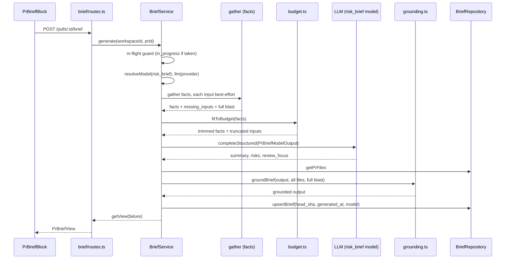
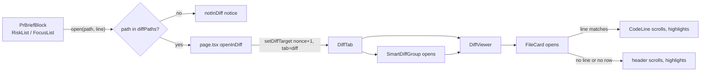

# PR Brief
<!-- verified against 76c63a5 + working tree on 2026-10-06 · sources: server/src/modules/brief/, server/src/modules/_shared/diff-hunks.ts, server/src/modules/_shared/context-paths.ts, server/src/vendor/shared/contracts/brief.ts, server/src/platform/container.ts, client/src/lib/hooks/brief.ts, client/src/components/diff-viewer/target.ts, client/src/app/repos/[repoId]/pulls/[number]/ -->

The PR Brief is one model-written summary of a pull request: a summary, a list of risks and a short review-focus list that links into the diff. Read this when you change how a brief is generated, stored or shown, or how the Overview tab navigates to Files changed. Spec: [`specs/010-pr-brief.md`](../specs/010-pr-brief.md). Plan: [`plans/28-pr-brief.md`](plans/28-pr-brief.md).

This is an explanation of how the feature is built. The HTTP contract is in [API](#api).

## API

Both routes live in `server/src/modules/brief/routes.ts` and return the same `PrBriefView` (`server/src/vendor/shared/contracts/brief.ts`; the client copy under `client/src/vendor/shared` is kept in sync).

| Route | Behaviour |
|---|---|
| `GET /pulls/:id/brief` | `BriefService.getView`. Reads the stored brief and computes staleness. Never calls the model. |
| `POST /pulls/:id/brief` | `BriefService.generate`. Runs a generation and returns the resulting view. Rate limit 10 per minute. |

Both answer 404 (`NotFoundError`) only when the PR is not in the caller's workspace. A failed generation is **not** an error status: the POST returns 200 with `failure` set.

`PrBriefView` fields:

| Field | Meaning |
|---|---|
| `pr_id`, `pr_head_sha` | The PR and its current head. |
| `brief` | `PrBrief` or `null`. A stored row that fails `PrBrief.safeParse` is served as `null`. |
| `stale` | `true` when `brief.head_sha` differs from `pr_head_sha`. `false` when there is no brief. |
| `generating` | `true` while a generation for this PR is in flight. |
| `failure` | `no_key`, `over_budget`, `failed`, `in_progress` or `null`. |

`PrBrief` holds `summary`, `risks: { risks: Risk[] }`, `review_focus: ReviewFocusItem[]` (`file`, `line`, `reason`), `missing_inputs: BriefMissingInput[]` (`input`, `status` = `missing | partial | truncated | stale`, `ref`, `reason`), `head_sha`, `generated_at` and `model` (`provider`, `model`). `intent`, `blast` and `history` are legacy optional fields that are never written; the Intent and Blast radius cards read live data.

`failure` values come from `classifyBriefError` in `server/src/modules/brief/helpers.ts`: `ConfigError` → `no_key`, `BriefBudgetError` → `over_budget`, anything else → `failed`. `in_progress` is returned by a second POST while one is running for the same PR.

## Generation flow

`container.brief` in `server/src/platform/container.ts` builds one `BriefService` per app. It reuses the intent, blast, smart-diff, agents and context services, the tokenizer and `resolveFeatureModel`. The in-flight guard is an in-memory `Set` of PR ids inside the service, so it is correct for a single API instance only.

The sequence shows one successful POST. The steps, in order (`server/src/modules/brief/service.ts`, `run`):

1. **Guard and model.** `generate` adds the PR id to the in-flight set before its first `await`. It then resolves the model for the `risk_brief` feature slot and the provider client. A missing key raises `ConfigError` here, before any input is read.
2. **Facts.** `gather` reads, each in its own `try/catch`: smart-diff roles per file, the stored intent, the blast radius, the latest review's non-dismissed findings, linked issues, and the project-context documents of the enabled agents. Changed-line ranges per file come from `changedLineRanges` in `server/src/modules/_shared/diff-hunks.ts`. Document paths are merged with `mergeContextPaths` from `server/src/modules/_shared/context-paths.ts`. An input that fails or is absent adds a `missing_inputs` entry (`missing`, `stale`, `partial`) and generation continues.
3. **Caps.** `capBlast` in `server/src/modules/brief/budget.ts` cuts the blast facts to 30 symbols, 20 endpoints and 20 crons (`server/src/modules/brief/constants.ts`) and records a `truncated` `blast_radius` entry.
4. **Token budget and trim.** `fitToBudget` counts the messages from `buildBriefMessages` with the injected tokenizer. The budget is `BRIEF_INPUT_TOKEN_BUDGET` (8000) minus `SCHEMA_TOKEN_RESERVE` (800). While over, the first non-empty group in `TRIM_ORDER` loses its last item: attached specs, linked issue, PR description, blast callers, blast symbols, review findings, changed files. Each touched input is recorded once as `truncated`. If every group is empty and the facts still do not fit, it throws `BriefBudgetError`.
5. **One model call.** `completeStructured` with `PrBriefModelOutput`, temperature 0, 2000 output tokens, 90 s timeout, `maxRetries: 0` and `requireParameters: true`. A schema-validation failure is a failure; there is no retry. The prompt (`server/src/modules/brief/prompt.ts`) is an explicit projection of the facts, so patch bodies and finding rationales never reach the model, and third-party text is wrapped as untrusted.
6. **Grounding.** `groundBrief` in `server/src/modules/brief/grounding.ts` checks the output against **all** PR files and the **full** blast result, not the trimmed prompt copy. A risk keeps only file refs that are a diff file or a blast file (at most 5), and is dropped when none remain. A review-focus item must sit inside a changed hunk or on a blast caller line; duplicates are removed and at most 6 are kept. Dropped items vanish silently.
7. **Cache.** `BriefRepository.upsertBrief` writes the `pr_brief` row (one per PR). `head_sha` is the PR head captured before the model call, so a PR refresh during generation leaves the brief stale rather than mislabelled. `getView` then compares it with the PR's current head to set `stale`.

On any error the stored row is untouched, the error is logged by class name only, and the returned view carries `failure` (the previous brief, if any, is still in `brief`). The in-flight entry is always removed in `finally`.

## Client

### Where the data comes from

`client/src/lib/hooks/brief.ts`:

- `usePrBrief(prId)` runs the GET. It polls every 2 s only while the view says `generating`. The query never POSTs.
- `useGeneratePrBrief()` runs the POST, writes the returned view into the query cache, and refetches the key on a request error.

### The block

`PrBriefBlock` (`client/src/app/repos/[repoId]/pulls/[number]/_components/PrBriefBlock/PrBriefBlock.tsx`) is the Overview tab's PR Brief section. It shows, top to bottom: a Generate / Refresh button, then a card with a skeleton while loading or generating, or the failure alert (`no_key` links to `/settings/models`, `over_budget`, `failed` with Try again), or the latest review's verdict banner, the summary, a stale note, the `missing_inputs` notes, `RiskList` and `FocusList`. The live Intent and Blast radius cards render below it from their own data, so they show even when no brief exists. Only the buttons POST.

The stale note appears when the view says `stale` or when `brief.head_sha` differs from the head sha the page passes in (`isStale` in the block's `helpers.ts`).

### Overview → Files changed

The flow, from the code:

1. A risk file ref or a focus item calls `open(path, line)` in `PrBriefBlock`. If `path` is not in the `diffPaths` prop, the block shows a `notInDiff` notice and does nothing else.
2. `openInDiff` in `client/src/app/repos/[repoId]/pulls/[number]/page.tsx` stores `{ path, line, nonce }` as `DiffTarget` (`client/src/components/diff-viewer/target.ts`) with `nonce` one higher than the previous, and sets `?tab=diff`. Switching tabs by hand through `onSetTab` clears the target.
3. `DiffTab` passes `target` to `DiffViewer` and, in the smart-diff view, only to the `SmartDiffGroup` that holds `target.path`. That group opens itself, including a role that is collapsed by default.
4. `FileCard` opens when the target path is its file. If a non-hunk row has `newNo === line`, it hands the nonce to that `CodeLine`, which scrolls to the row and highlights it. With `line: null` or no matching row, `FileCard` scrolls to and highlights its header. Highlights last `TARGET_HIGHLIGHT_MS` (2 s).
5. `SmartDiffGroup`, `FileCard` and `CodeLine` each keep the last applied nonce in a ref and apply a given nonce once. A component that mounts with the target already set (after the tab switch) applies it; a re-render with the same nonce does nothing; a repeated click gets a new nonce and applies again.

## Not covered here

Rationale for the 8000-token budget, the 800-token schema reserve and the trim order is not stated in the code. Rationale not found — human input required.
