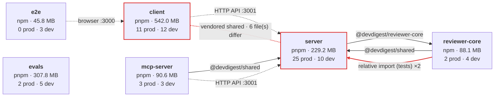
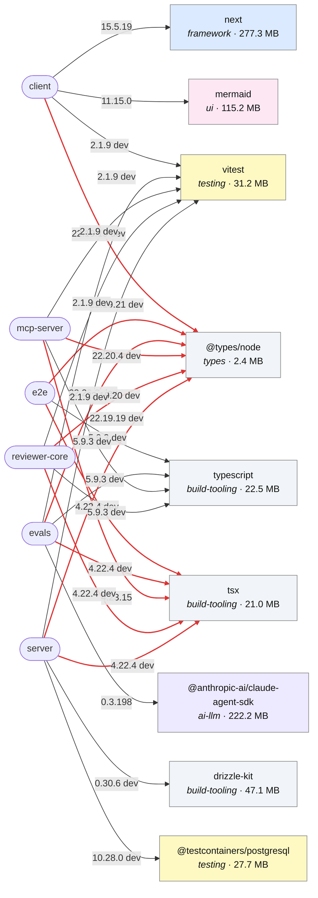
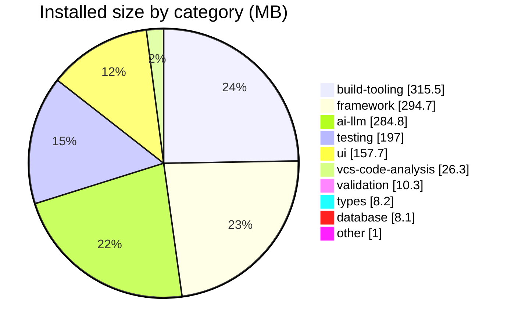

# Dependency report — 2026-10-08

> Commit `ad1fae8` on `L06_lab` (uncommitted changes present) · mode **offline** · generated by the `dependency-checker` skill (`collect.mjs` → `render.mjs`). Numbers are facts from `deps.json`; regenerate rather than edit them.

## Scope

6 standalone packages (each with its own manifest and lock file; no workspace). Online checks (`outdated`, `audit`): **not run — pass `--online`**.

| Package | Manager | Lock file | Installed | Prod | Dev | Peer/opt | Files scanned |
|---|---|---|---|---|---|---|---|
| `client/` | pnpm | pnpm-lock.yaml | yes | 11 | 12 | 0 | 512 |
| `e2e/` | npm | package-lock.json | yes | 0 | 3 | 0 | 3 |
| `evals/` | pnpm | pnpm-lock.yaml | yes | 2 | 5 | 0 | 38 |
| `mcp-server/` | pnpm | pnpm-lock.yaml | yes | 3 | 3 | 0 | 33 |
| `reviewer-core/` | npm | package-lock.json | yes | 2 | 4 | 0 | 31 |
| `server/` | pnpm | pnpm-lock.yaml | yes | 25 | 10 | 0 | 278 |

**How to read the numbers**

- *Size* is apparent bytes of the installed files (`node_modules`), not what ships to a browser.
- *Closure* = the dependency plus everything it pulls in. *Exclusive* = what removing it alone would free (parts shared with other direct deps excluded). Peer dependencies are billed to the package that declares them.
- *Unused* means no import, script binary, string reference, `@types` target or peer use was found — a **candidate** to verify, not a verdict.
- Internal edges come from `tsconfig` `paths`, relative imports that land in another package, same-named `src/vendor/*` copies, and declared runtime (HTTP) edges re-checked against their evidence file.

## Dependency graph

### Components

Legend: solid arrow = compile-time alias (`tsconfig` `paths`) · thick arrow = relative import across packages · dotted arrow = runtime call (HTTP/browser) · dotted line = vendored copy (label shows drift). Red = an edge with a finding.

### Heaviest and shared external dependencies

Per package: its 3 heaviest direct dependencies by closure, plus every dependency declared by several packages at **different** versions (red edges). Edge label = installed version.

## Size breakdown

Total installed across all packages: **1303.5 MB** (each package installs its own copy; nothing is shared between packages).

### Per package

| Package | Direct deps | Unique installed pkgs | Installed size | Prod closure | Heaviest direct dep |
|---|---|---|---|---|---|
| `client` | 23 | 430 | 542.0 MB | 448.0 MB | next (277.3 MB) |
| `e2e` | 3 | 7 | 45.8 MB | 0 KB | typescript (22.5 MB) |
| `evals` | 7 | 98 | 307.8 MB | 232.6 MB | @anthropic-ai/claude-agent-sdk (222.2 MB) |
| `mcp-server` | 6 | 140 | 90.6 MB | 34.6 MB | vitest (31.2 MB) |
| `reviewer-core` | 6 | 87 | 88.1 MB | 13.8 MB | vitest (31.1 MB) |
| `server` | 35 | 427 | 229.2 MB | 85.0 MB | drizzle-kit (47.1 MB) |

### Heaviest direct dependencies (top 15 by closure)

| # | Dependency | Package | Kind | Category | Version | Own | Closure | Exclusive | Transitive | Used via |
|---|---|---|---|---|---|---|---|---|---|---|
| 1 | `next` | client | prod | framework | 15.5.19 | 133.0 MB | 277.3 MB | 274.8 MB | 17 | import |
| 2 | `@anthropic-ai/claude-agent-sdk` | evals | prod | ai-llm | 0.3.198 | 3.5 MB | 222.2 MB | 222.2 MB | 1 | import |
| 3 | `mermaid` | client | prod | ui | 11.15.0 | 72.8 MB | 115.2 MB | 113.4 MB | 110 | import |
| 4 | `drizzle-kit` | server | dev | build-tooling | 0.30.6 | 7.4 MB | 47.1 MB | 47.0 MB | 22 | import |
| 5 | `vitest` | mcp-server | dev | testing | 2.1.9 | 1.6 MB | 31.2 MB | 31.0 MB | 43 | import |
| 6 | `vitest` | evals | dev | testing | 2.1.9 | 1.6 MB | 31.1 MB | 30.9 MB | 43 | import |
| 7 | `vitest` | reviewer-core | dev | testing | 2.1.9 | 1.6 MB | 31.1 MB | 30.9 MB | 43 | import |
| 8 | `vitest` | client | dev | testing | 2.1.9 | 1.6 MB | 31.1 MB | 30.1 MB | 43 | import |
| 9 | `vitest` | server | dev | testing | 2.1.9 | 1.6 MB | 31.1 MB | 30.8 MB | 43 | import |
| 10 | `@testcontainers/postgresql` | server | dev | testing | 10.28.0 | 18 KB | 27.7 MB | 18 KB | 157 | import |
| 11 | `testcontainers` | server | dev | testing | 10.28.0 | 379 KB | 27.7 MB | 0 KB | 156 | none |
| 12 | `lucide-react` | client | prod | ui | 0.469.0 | 27.3 MB | 27.3 MB | 27.3 MB | 0 | import |
| 13 | `typescript` | client | dev | build-tooling | 5.9.3 | 22.5 MB | 22.5 MB | 22.5 MB | 0 | script |
| 14 | `typescript` | e2e | dev | build-tooling | 5.9.3 | 22.5 MB | 22.5 MB | 22.5 MB | 0 | script |
| 15 | `typescript` | evals | dev | build-tooling | 5.9.3 | 22.5 MB | 22.5 MB | 22.5 MB | 0 | script |

### By category

| Category | Direct deps | Installed size | Share |
|---|---|---|---|
| build-tooling | 19 | 315.5 MB | 24.2% |
| framework | 11 | 294.7 MB | 22.6% |
| ai-llm | 7 | 284.8 MB | 21.8% |
| testing | 10 | 197.0 MB | 15.1% |
| ui | 6 | 157.7 MB | 12.1% |
| vcs-code-analysis | 8 | 26.3 MB | 2.0% |
| validation | 4 | 10.3 MB | 0.8% |
| types | 10 | 8.2 MB | 0.6% |
| database | 2 | 8.1 MB | 0.6% |
| other | 3 | 979 KB | 0.1% |

### Full inventory

<b>client</b> — 23 direct dependencies, 542.0 MB

| Dependency | Kind | Range | Installed | Category | Closure | Exclusive | Transitive | Used via | Evidence |
|---|---|---|---|---|---|---|---|---|---|
| `next` | prod | `^15.1.3` | 15.5.19 | framework | 277.3 MB | 274.8 MB | 17 | import | `next-env.d.ts:1` `next-env.d.ts:2` |
| `mermaid` | prod | `^11.15.0` | 11.15.0 | ui | 115.2 MB | 113.4 MB | 110 | import | `src/components/mermaid-diagram/MermaidDiagram.tsx:53` |
| `vitest` | dev | `^2.1.8` | 2.1.9 | testing | 31.1 MB | 30.1 MB | 43 | import | `src/app/agents/[id]/_components/AgentEditor/AgentEditor.test.tsx:1` `src/app/agents/[id]/_components/AgentEditor/_components/ContextTab/ContextTab.test.tsx:4` |
| `lucide-react` | prod | `^0.469.0` | 0.469.0 | ui | 27.3 MB | 27.3 MB | 0 | import | `src/vendor/ui/icons.tsx:83` |
| `typescript` | dev | `^5.7.2` | 5.9.3 | build-tooling | 22.5 MB | 22.5 MB | 0 | script | — |
| `@tailwindcss/postcss` | dev | `^4.0.0` | 4.3.0 | build-tooling | 15.7 MB | 13.8 MB | 22 | string-ref | `postcss.config.mjs:4` |
| `jsdom` | dev | `^25.0.1` | 25.0.1 | testing | 13.2 MB | 12.5 MB | 59 | string-ref | `vitest.config.ts:15` |
| `@vitejs/plugin-react` | dev | `^4.3.4` | 4.7.0 | build-tooling | 11.9 MB | 9.2 MB | 48 | import | `vitest.config.ts:2` |
| `recharts` | prod | `^2.15.0` | 2.15.4 | ui | 10.5 MB | 7.7 MB | 40 | import | `src/vendor/ui/charts/Donut.tsx:3` `src/vendor/ui/charts/LineChart.tsx:10` |
| `react-dom` | prod | `^19.0.0` | 19.2.7 | framework | 7.1 MB | 7.1 MB | 1 | import | `src/components/findings-preview/FindingsPreview.tsx:5` |
| `zod` | prod | `^3.24.1` | 3.25.76 | validation | 3.4 MB | 3.4 MB | 0 | import | `src/vendor/shared/adapters.ts:1` `src/vendor/shared/contracts/brief.ts:1` |
| `@tanstack/react-query` | prod | `^5.62.8` | 5.101.0 | ui | 3.0 MB | 3.0 MB | 1 | import | `src/app/agents/_components/AgentCard/AgentCard.test.tsx:4` `src/app/repos/[repoId]/context/page.test.tsx:10` |
| `react-markdown` | prod | `^9.0.3` | 9.1.0 | ui | 2.7 MB | 902 KB | 81 | import | `src/app/repos/[repoId]/onboarding-tour/_components/SafeMarkdown/SafeMarkdown.tsx:8` `src/vendor/ui/primitives/Markdown.tsx:2` |
| `@types/node` | dev | `^22.10.0` | 22.19.19 | types | 2.4 MB | 2.4 MB | 1 | types | — |
| `next-intl` | prod | `^3.26.0` | 3.26.5 | framework | 2.3 MB | 2.0 MB | 11 | import | `next.config.mjs:1` `src/app/agents/[id]/_components/AgentEditor/AgentEditor.test.tsx:3` |
| `remark-gfm` | prod | `^4.0.0` | 4.0.1 | ui | 2.3 MB | 538 KB | 67 | import | `src/app/repos/[repoId]/onboarding-tour/_components/SafeMarkdown/SafeMarkdown.tsx:9` `src/vendor/ui/primitives/Markdown.tsx:3` |
| `@types/react` | dev | `^19.0.2` | 19.2.16 | types | 1.6 MB | 398 KB | 1 | types | — |
| `@testing-library/jest-dom` | dev | `^6.6.3` | 6.9.1 | testing | 1021 KB | 1014 KB | 9 | import | `src/test/setup.ts:1` |
| `tailwindcss` | dev | `^4.0.0` | 4.3.0 | build-tooling | 737 KB | 0 KB | 0 | import | `src/app/globals.css:2` `src/app/globals.css:2` |
| `@testing-library/react` | dev | `^16.1.0` | 16.3.2 | testing | 571 KB | 329 KB | 1 | import | `src/app/agents/[id]/_components/AgentEditor/AgentEditor.test.tsx:2` `src/app/agents/[id]/_components/AgentEditor/_components/ContextTab/ContextTab.test.tsx:5` |
| `postcss` | dev | `^8.4.49` | 8.5.15 | build-tooling | 376 KB | 0 KB | 3 | none | — |
| `react` | prod | `^19.0.0` | 19.2.7 | framework | 168 KB | 168 KB | 0 | import | `src/app/agents/[id]/_components/AgentEditor/AgentEditor.tsx:5` `src/app/agents/[id]/_components/AgentEditor/_components/ConfigTab/ConfigTab.tsx:3` |
| `@types/react-dom` | dev | `^19.0.2` | 19.2.3 | types | 29 KB | 29 KB | 0 | types | — |

<b>e2e</b> — 3 direct dependencies, 45.8 MB

| Dependency | Kind | Range | Installed | Category | Closure | Exclusive | Transitive | Used via | Evidence |
|---|---|---|---|---|---|---|---|---|---|
| `typescript` | dev | `^5.7.2` | 5.9.3 | build-tooling | 22.5 MB | 22.5 MB | 0 | script | — |
| `tsx` | dev | `^4.19.2` | 4.22.4 | build-tooling | 20.9 MB | 20.9 MB | 3 | script | — |
| `@types/node` | dev | `^22.10.0` | 22.19.21 | types | 2.4 MB | 2.4 MB | 1 | types | — |

<b>evals</b> — 7 direct dependencies, 307.8 MB

| Dependency | Kind | Range | Installed | Category | Closure | Exclusive | Transitive | Used via | Evidence |
|---|---|---|---|---|---|---|---|---|---|
| `@anthropic-ai/claude-agent-sdk` | prod | `^0.3.198` | 0.3.198 | ai-llm | 222.2 MB | 222.2 MB | 1 | import | `src/runtime/run-claude.ts:6` |
| `vitest` | dev | `^2.1.0` | 2.1.9 | testing | 31.1 MB | 30.9 MB | 43 | import | `src/dsl/case.ts:11` `src/dsl/describe.ts:7` |
| `typescript` | dev | `^5.6.0` | 5.9.3 | build-tooling | 22.5 MB | 22.5 MB | 0 | script | — |
| `tsx` | dev | `^4.19.0` | 4.22.4 | build-tooling | 21.0 MB | 20.8 MB | 3 | script | `src/git.ts:4` `src/index.ts:4` |
| `openai` | prod | `^4.77.0` | 4.104.0 | ai-llm | 10.4 MB | 8.0 MB | 38 | import | `src/runtime/run-openrouter.ts:14` |
| `@types/node` | dev | `^22.0.0` | 22.20.0 | types | 2.4 MB | 0 KB | 1 | types | — |
| `gray-matter` | dev | `^4.0.3` | 4.0.3 | build-tooling | 812 KB | 812 KB | 9 | import | `src/skill-quality.ts:11` |

<b>mcp-server</b> — 6 direct dependencies, 90.6 MB

| Dependency | Kind | Range | Installed | Category | Closure | Exclusive | Transitive | Used via | Evidence |
|---|---|---|---|---|---|---|---|---|---|
| `vitest` | dev | `^2.1.8` | 2.1.9 | testing | 31.2 MB | 31.0 MB | 43 | import | `test/blast.test.ts:1` `test/conventions.test.ts:1` |
| `typescript` | dev | `^5.7.2` | 5.9.3 | build-tooling | 22.5 MB | 22.5 MB | 0 | script | — |
| `tsx` | prod | `^4.19.2` | 4.23.15 | build-tooling | 20.9 MB | 20.7 MB | 3 | script | — |
| `@modelcontextprotocol/sdk` | prod | `^1.31.0` | 1.31.0 | ai-llm | 13.7 MB | 10.3 MB | 91 | import | `src/index.ts:1` `src/server.ts:1` |
| `zod` | prod | `^3.25.0` | 3.25.76 | validation | 3.4 MB | 0 KB | 0 | string-ref | `src/http/schemas.ts:1` `src/index.ts:2` |
| `@types/node` | dev | `^22.10.0` | 22.20.4 | types | 2.4 MB | 2.4 MB | 1 | types | — |

<b>reviewer-core</b> — 6 direct dependencies, 88.1 MB

| Dependency | Kind | Range | Installed | Category | Closure | Exclusive | Transitive | Used via | Evidence |
|---|---|---|---|---|---|---|---|---|---|
| `vitest` | dev | `^2.1.8` | 2.1.9 | testing | 31.1 MB | 30.9 MB | 43 | import | `test/intent-classify.test.ts:1` `test/llm-call.test.ts:1` |
| `typescript` | dev | `^5.7.2` | 5.9.3 | build-tooling | 22.5 MB | 22.5 MB | 0 | script | — |
| `tsx` | dev | `^4.19.2` | 4.22.4 | build-tooling | 20.9 MB | 20.7 MB | 3 | none | — |
| `openai` | prod | `^4.77.0` | 4.104.0 | ai-llm | 10.4 MB | 8.0 MB | 38 | import | `src/llm/openrouter.ts:1` `src/llm/structured.ts:2` |
| `zod` | prod | `^3.24.1` | 3.25.76 | validation | 3.4 MB | 3.4 MB | 0 | string-ref | `src/llm/structured.ts:1` `src/review/run.ts:1` |
| `@types/node` | dev | `^22.10.0` | 22.19.20 | types | 2.4 MB | 0 KB | 1 | types | — |

<b>server</b> — 35 direct dependencies, 229.2 MB

| Dependency | Kind | Range | Installed | Category | Closure | Exclusive | Transitive | Used via | Evidence |
|---|---|---|---|---|---|---|---|---|---|
| `drizzle-kit` | dev | `^0.30.1` | 0.30.6 | build-tooling | 47.1 MB | 47.0 MB | 22 | import | `drizzle.config.ts:2` |
| `vitest` | dev | `^2.1.8` | 2.1.9 | testing | 31.1 MB | 30.8 MB | 43 | import | `test/adapters.test.ts:1` `test/agents-context.it.test.ts:1` |
| `@testcontainers/postgresql` | dev | `^10.16.0` | 10.28.0 | testing | 27.7 MB | 18 KB | 157 | import | `test/helpers/pg.ts:1` |
| `testcontainers` | dev | `^10.16.0` | 10.28.0 | testing | 27.7 MB | 0 KB | 156 | none | — |
| `typescript` | dev | `^5.7.2` | 5.9.3 | build-tooling | 22.5 MB | 22.5 MB | 0 | import | `test/onboarding-architecture.test.ts:5` |
| `js-tiktoken` | prod | `^1.0.21` | 1.0.21 | ai-llm | 21.4 MB | 21.4 MB | 1 | import | `src/adapters/tokenizer/index.ts:16` |
| `tsx` | dev | `^4.19.2` | 4.22.4 | build-tooling | 20.9 MB | 20.7 MB | 3 | script | `src/modules/conventions/skill-body.ts:71` `src/platform/prompts.ts:13` |
| `octokit` | prod | `^4.0.3` | 4.1.4 | vcs-code-analysis | 10.6 MB | 10.5 MB | 32 | import | `src/adapters/github/octokit.ts:1` |
| `openai` | prod | `^4.77.0` | 4.104.0 | ai-llm | 10.4 MB | 4.0 MB | 38 | import | `src/adapters/llm/openai.ts:1` `test/onboarding-architecture.test.ts:192` |
| `drizzle-orm` | prod | `^0.38.3` | 0.38.4 | database | 7.8 MB | 7.8 MB | 0 | import | `src/adapters/auth/local.ts:2` `src/app.ts:12` |
| `@anthropic-ai/sdk` | prod | `^0.33.1` | 0.33.1 | ai-llm | 7.4 MB | 1.0 MB | 38 | import | `src/adapters/llm/anthropic.ts:1` |
| `@ast-grep/napi` | prod | `0.43.0` | 0.43.0 | vcs-code-analysis | 7.1 MB | 7.1 MB | 1 | import | `src/adapters/astgrep/index.ts:20` `test/onboarding-architecture.test.ts:189` |
| `fastify` | prod | `^5.2.0` | 5.8.5 | framework | 6.9 MB | 6.5 MB | 47 | import | `src/app.ts:1` `src/modules/_shared/context.ts:1` |
| `@vscode/ripgrep` | prod | `^1.15.9` | 1.18.0 | vcs-code-analysis | 4.3 MB | 4.3 MB | 1 | string-ref | `src/adapters/codeindex/ripgrep.ts:21` |
| `dependency-cruiser` | prod | `^17.4.3` | 17.4.3 | build-tooling | 4.3 MB | 3.9 MB | 42 | import | `src/adapters/depgraph/index.ts:17` |
| `zod` | prod | `^3.24.1` | 3.25.76 | validation | 3.4 MB | 3.4 MB | 0 | import | `src/adapters/mocks.ts:1` `src/app.ts:13` |
| `graphology` | prod | `^0.26.0` | 0.26.0 | vcs-code-analysis | 2.7 MB | 2.6 MB | 1 | import | `src/modules/repo-intel/pipeline/rank.ts:16` |
| `@types/node` | dev | `^22.10.0` | 22.19.19 | types | 2.4 MB | 0 KB | 1 | types | — |
| `simple-git` | prod | `^3.27.0` | 3.36.0 | vcs-code-analysis | 1.1 MB | 1.0 MB | 6 | import | `src/adapters/git/simple-git.ts:1` `test/onboarding-architecture.test.ts:186` |
| `pino-pretty` | dev | `^13.0.0` | 13.1.3 | build-tooling | 788 KB | 508 KB | 18 | string-ref | `src/app.ts:57` |
| `fflate` | prod | `^0.8.3` | 0.8.3 | other | 778 KB | 778 KB | 0 | import | `src/modules/skills/helpers.ts:1` `test/skills-import.test.ts:2` |
| `graphology-metrics` | prod | `^2.4.0` | 2.4.0 | vcs-code-analysis | 756 KB | 717 KB | 7 | import | `src/modules/repo-intel/pipeline/rank.ts:17` |
| `@types/diff` | dev | `^8.0.0` | 8.0.0 | types | 603 KB | 2 KB | 1 | types | — |
| `diff` | prod | `^9.0.0` | 9.0.0 | vcs-code-analysis | 601 KB | 0 KB | 0 | import | `src/modules/skills/service.ts:3` |
| `@fastify/cors` | prod | `^10.0.2` | 10.1.0 | framework | 567 KB | 487 KB | 3 | import | `src/app.ts:2` |
| `fastify-sse-v2` | prod | `^4.2.1` | 4.2.2 | framework | 393 KB | 108 KB | 15 | import | `src/app.ts:5` |
| `@fastify/rate-limit` | prod | `^11.0.0` | 11.0.0 | framework | 302 KB | 212 KB | 3 | import | `src/app.ts:4` |
| `postgres` | prod | `^3.4.5` | 3.4.9 | database | 293 KB | 293 KB | 0 | import | `src/db/client.ts:1` `src/db/migrate.ts:2` |
| `fastify-type-provider-zod` | prod | `^4.0.2` | 4.0.2 | framework | 275 KB | 239 KB | 2 | import | `src/app.ts:11` `src/modules/agents/routes.ts:2` |
| `@fastify/helmet` | prod | `^13.0.2` | 13.0.2 | framework | 211 KB | 169 KB | 2 | import | `src/app.ts:3` |
| `@fastify/autoload` | prod | `^6.0.3` | 6.3.1 | framework | 171 KB | 171 KB | 0 | none | — |
| `p-queue` | prod | `^8.0.1` | 8.1.1 | other | 126 KB | 126 KB | 2 | import | `src/modules/repo-intel/pipeline/full.ts:25` `src/platform/jobs.ts:1` |
| `picomatch` | prod | `^4.0.4` | 4.0.4 | vcs-code-analysis | 89 KB | 0 KB | 0 | import | `src/modules/context/helpers.ts:2` |
| `dotenv` | prod | `^16.4.7` | 16.6.1 | other | 75 KB | 75 KB | 0 | import | `drizzle.config.ts:1` `src/db/backfill-run-cost.ts:1` |
| `@types/picomatch` | dev | `^4.0.3` | 4.0.3 | types | 17 KB | 17 KB | 0 | types | — |

## Findings & Priorities

| Tier | Meaning | Count |
|---|---|---|
| **P0** | Fix now — security exposure or a broken/irreproducible install. | 0 |
| **P1** | Fix this iteration — works today by accident, or will break on the next install/upgrade. | 1 |
| **P2** | Backlog — hygiene with a measurable payoff (MB, install time, clarity). | 9 |
| **Info** | Fact worth knowing — no action required unless it matters to you. | 7 |

A tier comes from the rule table in `collect.mjs`. A reviewer may move a finding **one** tier, and writes the reason under it as `Tier changed: P2 → P1 — <reason>`.

### Backlog (P0 → P2, ordered by tier, then rule)

| ID | Tier | Rule | Where | Effort | Action |
|---|---|---|---|---|---|
| F01 | P1 | `vendored-copy-drift` | `server, client` · `shared` | M | `shared` — 6 differing file(s), 0 only in client, 0 only in server |
| F02 | P2 | `cross-package-relative-import-test` | `reviewer-core` · `server` | M | `server` — 2 relative import(s) from tests reach into server/ instead of a declared alias or package |
| F03 | P2 | `duplicate-versions` | `evals` · `esbuild` | M | `esbuild` — 4 package(s) installed in several versions, 21.0 MB beyond one copy of each |
| F04 | P2 | `duplicate-versions` | `mcp-server` · `esbuild` | M | `esbuild` — 3 package(s) installed in several versions, 18.9 MB beyond one copy of each |
| F05 | P2 | `duplicate-versions` | `reviewer-core` · `esbuild` | M | `esbuild` — 4 package(s) installed in several versions, 21.0 MB beyond one copy of each |
| F06 | P2 | `duplicate-versions` | `server` · `esbuild` | M | `esbuild` — 26 package(s) installed in several versions, 59.1 MB beyond one copy of each |
| F07 | P2 | `unused-dependency` | `client` · `postcss` | S | `postcss` — no import, script, string reference or @types target found in 512 files |
| F08 | P2 | `unused-dependency` | `reviewer-core` · `tsx` | S | `tsx` — no import, script, string reference or @types target found in 31 files |
| F09 | P2 | `unused-dependency` | `server` · `@fastify/autoload` | S | `@fastify/autoload` — no import, script, string reference or @types target found in 278 files |
| F10 | P2 | `unused-dependency` | `server` · `testcontainers` | S | `testcontainers` — no import, script, string reference or @types target found in 278 files |

### P0 — Fix now

None.

### P1 — Fix this iteration

#### F01 · `vendored-copy-drift` · `server, client` · `shared`

- **What:** 6 differing file(s), 0 only in client, 0 only in server
- **Evidence:** `differs: adapters.ts`; `differs: contracts/eval-ci.ts`; `differs: contracts/knowledge.ts`
- **Advice:** The vendored copies differ. Diff them, decide which copy is upstream, and re-copy; then add a check (e.g. `diff -r` in CI) so they cannot drift again.
- **Effort:** M
- **Verified:** `diff -rq` lists the same 6 files. `CLAUDE.md` makes `server/src/vendor/shared` the upstream and `client/src/vendor/shared` the copy, so re-copy **server → client**, never the reverse. Already known as drift in root `INSIGHTS.md` (2026-09-17).

### P2 — Backlog

#### F02 · `cross-package-relative-import-test` · `reviewer-core` · `server`

- **What:** 2 relative import(s) from tests reach into server/ instead of a declared alias or package
- **Evidence:** `reviewer-core/test/intent-classify.test.ts:3 → ../../server/src/adapters/mocks.js`; `reviewer-core/test/run.test.ts:3 → ../../server/src/adapters/mocks.js`
- **Advice:** Reach the other package through a declared `tsconfig` alias or move the shared piece into the vendored shared contracts (or a test-utils folder). A relative path couples the folder layouts and bypasses the package boundary.
- **Effort:** M
- **Verified:** `reviewer-core/test/run.test.ts:3` and `intent-classify.test.ts:3` import `../../server/src/adapters/mocks.js`. Test-only, so `reviewer-core`'s runtime purity holds, but its tests cannot run without a `server/` checkout.

#### F03 · `duplicate-versions` · `evals` · `esbuild`

- **What:** 4 package(s) installed in several versions, 21.0 MB beyond one copy of each
- **Evidence:** `esbuild: 0.28.1 (10.2 MB), 0.21.5 (9.5 MB)`; `@esbuild/darwin-arm64: 0.28.1 (10.1 MB), 0.21.5 (9.4 MB)`; `@types/node: 22.20.0 (2.3 MB), 18.19.130 (2.0 MB)`; `undici-types: 6.21.0 (82 KB), 5.26.5 (71 KB)`
- **Advice:** Find who pulls the older copies and upgrade those parents (often a test or build tool). Dev-only duplicates cost disk and install time, not runtime.
- **Command:** `cd evals && pnpm why esbuild`
- **Effort:** M

#### F04 · `duplicate-versions` · `mcp-server` · `esbuild`

- **What:** 3 package(s) installed in several versions, 18.9 MB beyond one copy of each
- **Evidence:** `esbuild: 0.28.2 (10.2 MB), 0.21.5 (9.5 MB)`; `@esbuild/darwin-arm64: 0.28.2 (10.1 MB), 0.21.5 (9.4 MB)`; `content-type: 2.1.0 (23 KB), 1.0.5 (10 KB)`
- **Advice:** Find who pulls the older copies and upgrade those parents (often a test or build tool). Dev-only duplicates cost disk and install time, not runtime.
- **Command:** `cd mcp-server && pnpm why esbuild`
- **Effort:** M

#### F05 · `duplicate-versions` · `reviewer-core` · `esbuild`

- **What:** 4 package(s) installed in several versions, 21.0 MB beyond one copy of each
- **Evidence:** `esbuild: 0.28.0 (10.2 MB), 0.21.5 (9.5 MB)`; `@esbuild/darwin-arm64: 0.28.0 (10.1 MB), 0.21.5 (9.4 MB)`; `@types/node: 22.19.20 (2.3 MB), 18.19.130 (2.0 MB)`; `undici-types: 6.21.0 (82 KB), 5.26.5 (71 KB)`
- **Advice:** Find who pulls the older copies and upgrade those parents (often a test or build tool). Dev-only duplicates cost disk and install time, not runtime.
- **Command:** `cd reviewer-core && npm ls esbuild`
- **Effort:** M

#### F06 · `duplicate-versions` · `server` · `esbuild`

- **What:** 26 package(s) installed in several versions, 59.1 MB beyond one copy of each
- **Evidence:** `esbuild: 0.28.0 (10.2 MB), 0.21.5 (9.5 MB), 0.19.12 (9.4 MB), 0.18.20 (9.2 MB)`; `@esbuild/darwin-arm64: 0.28.0 (10.1 MB), 0.21.5 (9.4 MB), 0.19.12 (9.3 MB), 0.18.20 (9.1 MB)`; `@types/node: 22.19.19 (2.3 MB), 18.19.130 (2.0 MB)`; `mnemonist: 0.40.0 (375 KB), 0.39.8 (371 KB)`
- **Advice:** Find who pulls the older copies and upgrade those parents (often a test or build tool). Dev-only duplicates cost disk and install time, not runtime.
- **Command:** `cd server && pnpm why esbuild`
- **Effort:** M
- **Verified:** `pnpm why esbuild` in `server/`: 0.18/0.19 come from `drizzle-kit@0.30.6`, 0.21 from `vitest@2.1.9` → `vite@5`, 0.28 from `tsx`. The same `vitest@2` → `vite@5` chain causes F03–F05.

#### F07 · `unused-dependency` · `client` · `postcss`

- **What:** no import, script, string reference or @types target found in 512 files
- **Evidence:** `client/package.json → dev postcss@^8.4.49`
- **Advice:** Confirm it is not loaded dynamically or by a tool config, then remove it and run the package's typecheck and tests.
- **Command:** `cd client && pnpm remove postcss`
- **Effort:** S
- **Verified:** no direct import. `client/postcss.config.mjs` loads only `@tailwindcss/postcss`, and Next.js bundles its own PostCSS. The Tailwind v4 install guide still lists `postcss`, so remove it only after `pnpm build` passes without it.

#### F08 · `unused-dependency` · `reviewer-core` · `tsx`

- **What:** no import, script, string reference or @types target found in 31 files
- **Evidence:** `reviewer-core/package.json → dev tsx@^4.19.2`
- **Advice:** Confirm it is not loaded dynamically or by a tool config, then remove it and run the package's typecheck and tests. Frees ~20.7 MB.
- **Command:** `cd reviewer-core && npm uninstall tsx`
- **Effort:** S
- **Verified:** no script in `reviewer-core/package.json` (`typecheck`, `build`, `test`) and no source uses `tsx`.

#### F09 · `unused-dependency` · `server` · `@fastify/autoload`

- **What:** no import, script, string reference or @types target found in 278 files
- **Evidence:** `server/package.json → prod @fastify/autoload@^6.0.3`
- **Advice:** Confirm it is not loaded dynamically or by a tool config, then remove it and run the package's typecheck and tests. Frees ~171 KB.
- **Command:** `cd server && pnpm remove @fastify/autoload`
- **Effort:** S
- **Verified:** `server/src/modules/index.ts:25` says modules are registered explicitly "rather than via filesystem autoload"; nothing imports `@fastify/autoload`.

#### F10 · `unused-dependency` · `server` · `testcontainers`

- **What:** no import, script, string reference or @types target found in 278 files
- **Evidence:** `server/package.json → dev testcontainers@^10.16.0`
- **Advice:** Confirm it is not loaded dynamically or by a tool config, then remove it and run the package's typecheck and tests.
- **Command:** `cd server && pnpm remove testcontainers`
- **Effort:** S
- **Verified:** no file imports `testcontainers` directly. It arrives transitively through `@testcontainers/postgresql` (`test/helpers/pg.ts:1`).

### Info — Fact worth knowing

#### F11 · `heavy-dependency` · `client` · `mermaid`

- **What:** 115.2 MB with 110 transitive packages
- **Evidence:** `client/package.json → prod mermaid@^11.15.0`
- **Advice:** No action required. If it reaches a browser bundle, load it lazily (dynamic `import()`); if it is dev-only, the cost is install time only.
- **Effort:** —

#### F12 · `heavy-dependency` · `client` · `next`

- **What:** 277.3 MB with 17 transitive packages
- **Evidence:** `client/package.json → prod next@^15.1.3`
- **Advice:** No action required. If it reaches a browser bundle, load it lazily (dynamic `import()`); if it is dev-only, the cost is install time only.
- **Effort:** —

#### F13 · `heavy-dependency` · `evals` · `@anthropic-ai/claude-agent-sdk`

- **What:** 222.2 MB with 1 transitive packages
- **Evidence:** `evals/package.json → prod @anthropic-ai/claude-agent-sdk@^0.3.198`
- **Advice:** No action required. If it reaches a browser bundle, load it lazily (dynamic `import()`); if it is dev-only, the cost is install time only.
- **Effort:** —

#### F14 · `unresolved-specifier` · `evals`

- **What:** 2 bare specifier(s) resolve nowhere (likely text in strings/fixtures): fastify, @shared/review-types
- **Evidence:** `evals/agents/architecture-reviewer/architecture-reviewer.cases.ts:39`; `evals/skills/dependency-checker/dependency-checker.cases.ts:35`
- **Advice:** No action. Listed so a reviewer can confirm these are strings or fixtures, not real imports.
- **Effort:** —

#### F15 · `unresolved-specifier` · `server`

- **What:** 5 bare specifier(s) resolve nowhere (likely text in strings/fixtures): x, react, side-effect, @octokit/rest, failed
- **Evidence:** `server/src/adapters/astgrep/index.ts:551`; `server/test/astgrep.test.ts:124`; `server/test/astgrep.test.ts:182`; `server/test/onboarding-architecture.test.ts:187`
- **Advice:** No action. Listed so a reviewer can confirm these are strings or fixtures, not real imports.
- **Effort:** —

#### F16 · `version-drift-minor` · `client, e2e, evals, mcp-server, reviewer-core, server` · `@types/node`

- **What:** 5 versions across packages: 22.19.19 / 22.19.21 / 22.20.0 / 22.20.4 / 22.19.20
- **Evidence:** `client: 22.19.19 (^22.10.0, dev)`; `e2e: 22.19.21 (^22.10.0, dev)`; `evals: 22.20.0 (^22.0.0, dev)`; `mcp-server: 22.20.4 (^22.10.0, dev)`; `reviewer-core: 22.19.20 (^22.10.0, dev)`; `server: 22.19.19 (^22.10.0, dev)`
- **Advice:** Align on the next touch; low risk. Align every package on `22.20.4` (same range in each `package.json`), reinstall with each package's own manager.
- **Command:** `cd client && pnpm update @types/node ; cd e2e && npm update @types/node ; cd evals && pnpm update @types/node ; cd mcp-server && pnpm update @types/node ; cd reviewer-core && npm update @types/node ; cd server && pnpm update @types/node`
- **Effort:** S

#### F17 · `version-drift-minor` · `e2e, evals, mcp-server, reviewer-core, server` · `tsx`

- **What:** 2 versions across packages: 4.22.4 / 4.23.15
- **Evidence:** `e2e: 4.22.4 (^4.19.2, dev)`; `evals: 4.22.4 (^4.19.0, dev)`; `mcp-server: 4.23.15 (^4.19.2, prod)`; `reviewer-core: 4.22.4 (^4.19.2, dev)`; `server: 4.22.4 (^4.19.2, dev)`
- **Advice:** Align on the next touch; low risk. Align every package on `4.23.15` (same range in each `package.json`), reinstall with each package's own manager.
- **Command:** `cd e2e && npm update tsx ; cd evals && pnpm update tsx ; cd mcp-server && pnpm update tsx ; cd reviewer-core && npm update tsx ; cd server && pnpm update tsx`
- **Effort:** S

## Summary

### Key numbers

- 6 packages · 80 direct dependencies · **1303.5 MB** installed; largest: `client` (542.0 MB).
- Findings — P0: 0 · P1: 1 · P2: 9 · Info: 7.
- Removing every unused candidate would free ~20.9 MB (exclusive bytes).
- Internal edges: 3 alias, 1 relative-import, 1 vendored-copy, 3 runtime.

### Top actions

1. **[P1] F01** — re-sync the vendored contracts: copy `server/src/vendor/shared` over `client/src/vendor/shared` (6 files differ), then run `cd client && pnpm typecheck`. A `diff -rq` step in CI would stop it recurring.
2. **[P2] F09, F10, F08** — remove 3 confirmed-unused declarations: `cd server && pnpm remove @fastify/autoload testcontainers` and `cd reviewer-core && npm uninstall tsx`. Run each package's typecheck and tests.
3. **[P2] F03–F06** — one cause, four packages: `vitest@2` → `vite@5` pins esbuild 0.21, and in `server/` `drizzle-kit@0.30` adds 0.18/0.19 (~120 MB of duplicate copies in total). Fix it with the next planned vitest/drizzle-kit upgrade, not as a standalone task. These are dev-only, so the cost is install time, not runtime.
4. **[P2] F02** — `reviewer-core` tests import `server/src/adapters/mocks.js` by relative path. Move the mocks they need into `reviewer-core/test/` (or the shared vendor) so `reviewer-core` tests stand alone.
5. **[P2] F07** — `client` `postcss`: try removing it, and keep it if `pnpm build` fails.

Not checked: vulnerabilities and outdated versions (offline run; re-run `collect.mjs --online`).
