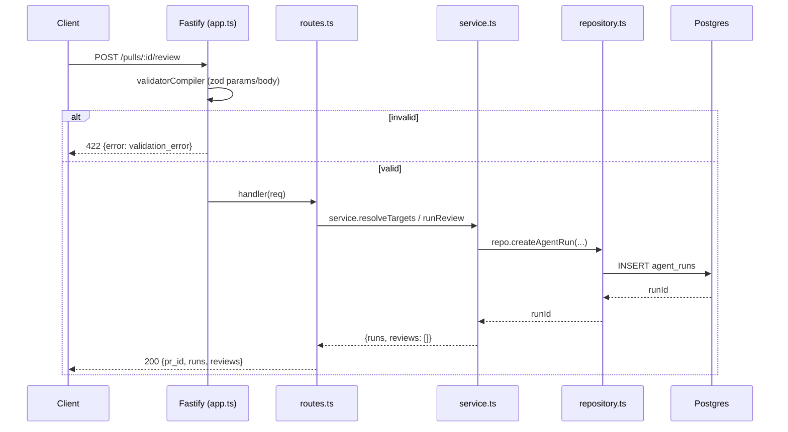
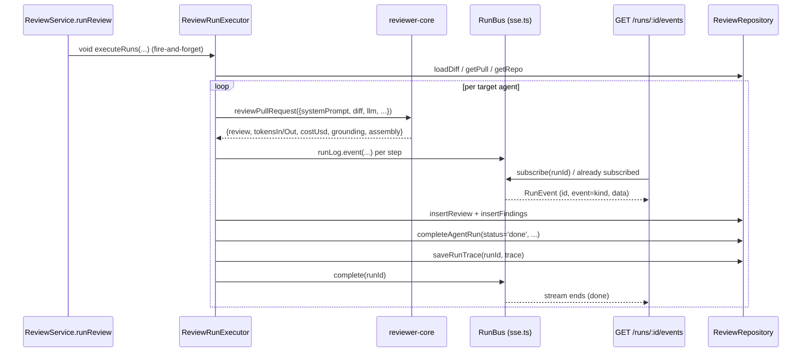

# Server architecture

How `@devdigest/api` is layered, wired, and run — read this when you need to
place new code in the right layer, add an adapter, or trace a request from the
route to the database. It does not repeat the API map, env table, or quick
start; those live in [`../README.md`](../README.md).

## 1. Onion layers

Each feature module is a stack of layers, imports pointing inward only:

```
routes.ts  →  service.ts  →  repository.ts / adapters (via container)  →  db
```

- **`routes.ts`** — Fastify plugin. Declares the zod `params`/`body` schema,
  resolves request context, calls the service, shapes the HTTP response. No
  business logic, no direct DB or adapter calls.
- **`service.ts`** — orchestration and business rules. Talks to the
  repository and to adapters, both reached only through `container` (never
  `new`'d). No Fastify types, no SQL.
- **`repository.ts`** (+ `repository/` subfolder) — the only layer that
  touches Drizzle. Takes/returns plain rows or DTOs; workspace-scoped.
- **adapters** — reached through `container`, not imported directly by a
  service; see §5.

`src/modules/reviews/` is the worked example:

- `routes.ts:20-27` builds `const service = new ReviewService(container)`
  from the Fastify-decorated `container`, then each route
  (`routes.ts:28-44` for `POST /pulls/:id/review`) validates `params` with
  `IdParams` (`../src/modules/_shared/schemas.ts:11`), resolves tenancy via
  `getContext` (`../src/modules/_shared/context.ts`), and delegates to
  `service.resolveTargets` / `service.runReview`.
- `service.ts:28` (`ReviewService`) holds only orchestration: it builds a
  `ReviewRepository` and a `ReviewRunExecutor` in its constructor
  (`service.ts:33-37`) and every method is a thin call into one of them —
  `runReview` (`service.ts:103`) creates `agent_runs` rows up front via
  `this.repo.createAgentRun`, then fires the background executor.
- `repository.ts:25-26` (`ReviewRepository`) is the sole DB-touching class for
  this domain; it composes three colocated query modules under
  `repository/` (§2) so its own public method surface stays a stable façade.

## 2. Module anatomy

A module folder is `src/modules/<name>/`:

| File | Role |
|---|---|
| `routes.ts` | Fastify plugin: schema, request context, response shape |
| `service.ts` | Orchestration; the only layer allowed to call adapters via `container` |
| `repository.ts` | Drizzle queries; may delegate to a `repository/` subfolder |
| `repository/*.repo.ts` | One file per aggregate when a module's queries outgrow one file — `reviews/repository/{pull,review,run}.repo.ts` (68/143/194 lines) hold pull/intent, review+findings, and agent-run+trace queries respectively; `repository.ts:25-26` composes them behind the class's original method names, so callers see no difference |
| `helpers.ts` | Pure functions (no DB/network/`this`) — e.g. `reviews/helpers.ts` holds the row↔DTO converters (`findingRowToDto`, `reviewToDto`) and re-exports `reduceReviews`/`sliceDiff` from `reviewer-core` |
| `constants.ts` | Module-local constants — e.g. `reviews/constants.ts:12` (`REVIEW_STRATEGY = 'single-pass'`) |

**`src/modules/_shared/`** (leading underscore — not itself a route module,
so it is not in the `modules/index.ts` registry) holds cross-module route
helpers every module uses: `context.ts` (`getContext`, tenancy resolution via
`container.auth`) and `schemas.ts` (`IdParams`, the `z.string().uuid()` params
schema most `/:id` routes share).

**Registration** — `src/modules/index.ts:27` exports a `modules` record; each
entry is one import plus one map key. `src/app.ts:169` (`await
app.register(plugin)`) walks that record after plugins and the error handler
are registered, so every module plugin inherits helmet/cors/rate-limit/SSE
(`src/app.ts:89-96`) and the structured error handler (`src/app.ts:116-152`).
Adding a module is "create `routes.ts`, add one import + one entry" — no
filesystem autoload, so the same code path works under `tsx`, the bundler,
and vitest (`src/modules/index.ts:19-23`).

## 3. Dependency injection

`src/platform/container.ts:65` (`Container`) is the composition root, one
instance per app (`src/app.ts:53`, `new Container(config, db, opts.overrides)`,
decorated onto the Fastify instance as `app.container`). It:

- holds `config`, `db`, `secrets`, `auth`, `jobs`, `runBus` as eager fields
  (`container.ts:66-71`);
- lazily constructs adapters behind getters/methods, caching the result —
  `get git()` (`container.ts:99-103`), `get codeIndex()`
  (`container.ts:117-121`), `async forge(ref)` (`container.ts:173-197`,
  cached per provider+instance so one workspace can hold a GitHub repo and two
  different self-managed GitLabs), `async llm(id)` (`container.ts:219-227`);
- exposes shared cross-module repositories as getters too —
  `get agentsRepo()` (`container.ts:105-107`), `get reviewRepo()`
  (`container.ts:113-115`) — constructed once in the composition root so
  modules share one instance instead of reaching into another module's folder.

A module gets the container from the Fastify instance in its `routes.ts`
(`const { container } = app;`, e.g. `reviews/routes.ts:21`) and passes it into
its service's constructor (`new ReviewService(container)`); the service never
imports an adapter module directly.

**Mocks** — `ContainerOverrides` (`container.ts:44-63`) lets a test replace
any port (`forge`, `git`, `llm`, `embedder`, `repoIntel`, …) when building the
app (`buildApp({ overrides })`, `src/app.ts:28-30`). The deterministic mock
implementations live in `src/adapters/mocks.ts` (`MockLLMProvider`,
`MockGitHubClient`, …) — no real network, fixture-driven `completeStructured`
so a full review/grounding flow is testable end-to-end without an LLM key.

## 4. Platform (`src/platform/`)

| File | Why it exists |
|---|---|
| `resilience.ts` | `withTimeout` / `withRetry` — every external call gets a deadline; retry only fires when the thrown error carries a recognizable `status` (`resilience.ts:35-46`, `defaultIsRetryable`) |
| `run-logger.ts` | Single sink for everything a review run does: streamed live over the SSE bus, captured into the run's event buffer for the persisted trace, and mirrored to pino — can target one run or fan out to several (shared pre-work before the per-agent loop) |
| `sse.ts` | `RunBus` — in-memory pub/sub per `runId`, buffers events for replay and tracks per-run completion/cancellation; `/runs/:id/events` subscribes to it |
| `jobs.ts` | `JobRunner` — a `p-queue`-backed queue mirrored into the `jobs` table (status/attempts/error), used by repo import and repo-intel indexing/polling (`container.jobs`, `src/modules/repos/service.ts`, `src/modules/repo-intel/{routes,service}.ts`); review runs do **not** go through it (§6) |
| `model-router.ts` | Picks a cheap vs. capable model per task kind and a TTL prompt cache; opt-in, not wired into the review path by default |
| `price-book.ts` | Live OpenRouter `/models` pricing, cached 6h, with the static `estimateCost` table as a cold/failed-cache fallback; injected into the OpenRouter provider's cost hook |
| `structured.ts` | Re-export shim — structured-output parsing (`toJsonSchema`, `parseWithRepair`) now lives in `@devdigest/reviewer-core`, kept importable at the old path |
| `trace-builder.ts` | The shared, Zod-validated builder for the single-document `RunTrace` persisted per run |
| `errors.ts` | `AppError` taxonomy + the `{ error: { code, message, details } }` envelope shape read by `app.setErrorHandler` |
| `config.ts` | `loadConfig` — zod-validated `AppConfig` from env; deliberately excludes API keys/tokens, which go through `SecretsProvider` instead (§5) |
| `forge-resolve.ts` | Pure helpers (`forgeCacheKey`, `forgeTokenKeys`, `DEFAULT_API_BASE`) for which forge client and which secret name a repo resolves to — kept out of `container.ts` so they're unit-testable without a DB |
| `grounding.ts` | Re-export shim — citation grounding (`groundFindings`) now lives in `@devdigest/reviewer-core` |
| `prompt.ts` | Re-export shim — prompt assembly (`assemblePrompt`, `wrapUntrusted`) now lives in `@devdigest/reviewer-core` |
| `prompts.ts` | Loads editable built-in agent system-prompt templates from `src/prompts/*.md`, interpolated with `{{var}}` — stable instruction text only; per-request data is assembled in code and passed through `prompt.ts` |

## 5. Adapters (`src/adapters/*`)

Each subfolder implements one port defined in `src/vendor/shared/adapters.ts`
(`LLMProvider:92`, `Embedder:101`, `ForgeClient:183`, `GitClient:246`,
`CodeIndex:291`, `AuthProvider:309`, `SecretsProvider:323`) plus a few
service-local ports (`RepoIntel`, `DepGraph`, `Tokenizer`) declared next to
their consumer. To add one: implement the interface, wire it behind a
`Container` getter/method (§3) with a cache field, and add the corresponding
key to `ContainerOverrides` so tests can inject a mock instead.

**The raw-`fetch` rule.** `withRetry` (`src/platform/resilience.ts:46`)
decides whether to retry from `err.status` / `err.statusCode` /
`err.response.status` (`resilience.ts:35-40`). SDK-based adapters
(`adapters/llm/openai.ts`, `adapters/llm/anthropic.ts`,
`adapters/github/octokit.ts`) throw errors that already carry `status`, so
wrapping a call in `withRetry(() => withTimeout(...))` works. A hand-rolled
`fetch`-based adapter does not: `fetch` resolves on 4xx/5xx instead of
throwing, so `if (!res.ok) throw new Error(...)` produces an error with no
`status`, and `withRetry` silently retries nothing on the first attempt. Any
new HTTP adapter without an SDK must `Object.assign(new Error(msg), { status:
res.status })` (or pass its own `opts.isRetryable`). Full write-up:
[`../INSIGHTS.md` — "`withRetry` is a silent no-op for an adapter built on raw
`fetch`"](../INSIGHTS.md#2026-09-23--withretry-is-a-silent-no-op-for-an-adapter-built-on-raw-fetch).

## 6. Request lifecycle



The route returns as soon as `agent_runs` rows exist; the review itself runs
in the background:



`ReviewService.runReview` (`src/modules/reviews/service.ts:103-136`) creates
one `agent_runs` row per target agent up front, then calls
`this.executor.executeRuns(...)` without awaiting it
(`service.ts:132-135`) — the HTTP response carries the `runId`s immediately.
`ReviewRunExecutor.executeRuns` / `runOneAgent`
(`src/modules/reviews/run-executor.ts:83`, `:167`) loads the diff once, then
per agent resolves the LLM provider, repo-intel context, and skills, calls the
pure `reviewPullRequest` from `@devdigest/reviewer-core`
(`run-executor.ts:229`), and persists the outcome. Every step is also pushed
through `RunLogger` onto `container.runBus` (`src/platform/sse.ts`), which
`GET /runs/:id/events` (`reviews/routes.ts:49-89`) drains as Server-Sent
Events, replaying the buffer first and then streaming live until
`runBus.onDone`. This background path does **not** go through `JobRunner`
(§4); it is a detached promise whose errors are caught and logged
(`service.ts:133-135`).

## 7. Data

- Schema lives in `src/db/schema/*.ts` (one file per domain: `reviews.ts`,
  `runs.ts`, `pulls.ts`, `repos.ts`, …), composed into a barrel at
  `src/db/schema.ts`.
- Naming: `camelCase` in TypeScript, `snake_case` in SQL — e.g.
  `workspaceId: uuid('workspace_id')` (`src/db/schema/reviews.ts:19-21`).
  Indexes are `<table>_<scope>_idx`, e.g. `reviews_pr_idx`
  (`src/db/schema/reviews.ts:38`), `agent_runs_pr_idx`
  (`src/db/schema/runs.ts:52`).
- Migrations are generated only — `pnpm db:generate` (drizzle-kit) writes into
  `src/db/migrations/`; they are **never applied on boot**
  (`src/app.ts` has no migrate call) — run `pnpm db:migrate` by hand after
  cloning or pulling a new migration.

Known traps, one line each — full write-ups in `server/INSIGHTS.md`:

- A nullable column added to a unique index stops deduplicating the NULL case,
  because Postgres treats NULLs as distinct in a unique index — index
  `coalesce(<col>, '')` instead. [INSIGHTS: 2026-09-23 — adding a NULLABLE
  column to a unique index silently stops
  deduplicating](../INSIGHTS.md#2026-09-23--adding-a-nullable-column-to-a-unique-index-silently-stops-deduplicating).
- A foreign-key column carries no index by default — `.references()` declares
  the constraint, not an index — so a filter on it sequential-scans until you
  add `index('<table>_<col>_idx')` yourself. [INSIGHTS: 2026-09-18 — a
  foreign-key column carries no index; every child-rows query
  scans](../INSIGHTS.md#2026-09-18--a-foreign-key-column-carries-no-index-every-child-rows-query-scans).
- `pnpm db:generate` can hang forever (no prompt rendered, reads no stdin) when
  one table both drops and adds columns in the same diff — split it into two
  generate runs. [INSIGHTS: 2026-09-22 — `pnpm db:generate` hangs forever when
  one table both drops and adds a
  column](../INSIGHTS.md#2026-09-22--pnpm-dbgenerate-hangs-forever-when-one-table-both-drops-and-adds-a-column).
- A `text(name, { enum: [...] })` column has no SQL constraint at all — adding
  an enum value is code-only, never a migration. [INSIGHTS: 2026-09-21 — a
  Drizzle `text(..., { enum })` column has NO constraint in
  SQL](../INSIGHTS.md#2026-09-21--a-drizzle-text--enum--column-has-no-constraint-in-sql).

## 8. Boundaries with `reviewer-core`

The server passes plain data and injected ports into the pure engine — no db,
github, or fs objects. `ReviewInput`
(`reviewer-core/src/review/run.ts:45-80`) takes: `systemPrompt`, `model`,
`diff` (already-parsed `UnifiedDiff`), an injected `llm: LLMProvider`,
`strategy`, and optional prompt-context strings (`skills`, `memory`, `specs`,
`callers`, `repoMap`, `prDescription`, `task`) plus a `sessionId` and
callbacks (`onEvent`, `checkCancelled`). `run-executor.ts` is the only layer
that resolves repo-intel, skills, and context documents from the DB/adapters
*before* calling `reviewPullRequest`; the engine itself only ever sees the
resolved strings.

Contracts (`@devdigest/shared`) live at `src/vendor/shared`, vendored — not a
generated artifact. The rule (`CLAUDE.md` → "Contracts change in `shared`
first"): edit `server/src/vendor/shared` first, then hand-mirror the same
field-level edit into `client/src/vendor/shared`. The two copies are **not**
kept in sync as a whole — `diff -r` between them is expected to be non-empty
(server-only provider ids, adapter methods) — so verify with a `diff` scoped
to the fields you touched, never whole-file equality. Full write-up:
[`../INSIGHTS.md` — "the two vendored `shared` copies are not actually in
sync"](../../INSIGHTS.md#2026-09-17--the-two-vendored-shared-copies-are-not-actually-in-sync).
