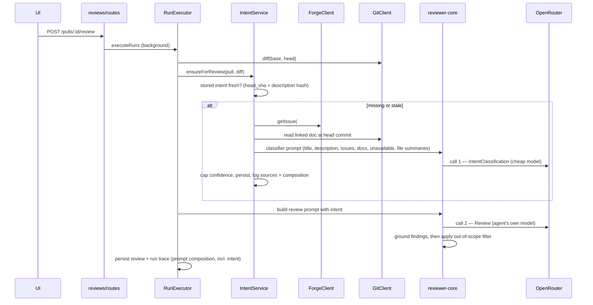

<!-- verified against 8796ec6 on 2026-09-26 · sources: server/src/db/schema/reviews.ts, server/src/vendor/shared/contracts/{brief,platform,trace}.ts, server/src/vendor/shared/adapters.ts, server/src/modules/reviews/repository/pull.repo.ts, server/src/modules/reviews/repository.ts, server/src/modules/reviews/run-executor.ts, reviewer-core/src/prompt.ts, reviewer-core/src/review/run.ts, reviewer-core/src/llm/openrouter.ts, client/src/lib/feature-models.ts, docs/plans/01-intent-layer.md -->

# 006 — Intent Layer

## Problem

The reviewer sees a diff, not a purpose. It has no way to tell "renamed a
parameter to match the new API" from "refactored unrelated formatting while
I was in the file", so a large or noisy PR gets flagged for things the author
never intended to touch, and a narrowly-scoped PR gets no credit for staying
narrow. Nothing in the run today reads the PR title, description, or linked
issue before building the prompt.

The scaffolding for this has existed for a while, unused:

| Already in the tree | Where | State |
|---|---|---|
| `pr_intent` table | `server/src/db/schema/reviews.ts` (`prIntent`) | has `pr_id`, `intent`, `in_scope`, `out_of_scope` only — no `head_sha`, `confidence`, `sources`, or staleness columns |
| `Intent` contract | `server/src/vendor/shared/contracts/brief.ts` | typed, composed into `PrBrief`, no writer |
| `upsertIntent` / `getIntent` | `server/src/modules/reviews/repository/pull.repo.ts`, `repository.ts` | implemented, called from nowhere in `src/` |
| `FEATURE_MODELS` entry `review_intent` | `server/src/vendor/shared/contracts/platform.ts`, mirrored in `client/src/lib/feature-models.ts` | registered (default `openai/gpt-4.1` today), Settings → Models renders it, no classifier consumes it |
| `ForgeClient.getIssue` | `server/src/vendor/shared/adapters.ts` | implemented on both forge adapters, no caller resolves a PR's linked issue from it |

This spec connects those pieces: a classifier reads the PR's own stated
intent (and what it links to), the result is persisted per PR, injected into
the review prompt, and used to drop findings the PR never claimed to touch —
without ever loosening the existing grounding gate.

## Scope

- A separate, cheap-model classification step that reads a PR's title,
  description, linked issue, a linked plan/spec document, and the changed
  files' hunk headers (paths and `@@` line ranges only, never hunk bodies),
  and produces a structured intent: a one-line summary, an in-scope list, an
  out-of-scope list, and a confidence.
- Persistence of that result per PR, keyed to the head commit and to a hash
  of the title + description it was computed from, so a later run can tell a
  fresh intent from a stale one and re-classify automatically.
- A `## PR intent` block injected into the main reviewer prompt as untrusted
  content, plus a trusted scope rule the model applies when deciding whether
  a finding is out of scope.
- An out-of-scope filter that runs **after** grounding: non-serious
  out-of-scope findings are dropped, serious ones (`CRITICAL` severity or
  `security` category) are collapsed to a single kept finding so a
  wide-reaching but real issue is never silenced outright.
- A separate, per-workspace-overridable model setting for the classifier
  (`review_intent` in the feature-model registry), independent of whichever
  model the reviewing agent uses.
- Two API endpoints to read the current intent and to force a re-classification.
- An Intent card on the PR Overview tab showing the summary, scope lists,
  confidence, sources, missing-context warnings, and a re-classify action.
- Observability: every classification logs its sources and prompt
  composition (section names, sizes, token counts), with no secrets, tokens,
  URLs with query strings, diff content, or fetched document/issue text ever
  written to a log or stored column.

**Not in scope.** Fetching non-forge links (Jira, Linear, Notion, or any URL
that isn't the same forge host) — these are recorded as unsupported context,
never fetched. Changing the existing linked-issue keyword matching used
elsewhere in the codebase. Persisting the out-of-scope flag on stored
findings. Changes to the PR list or timeline views. A dedicated `agent_runs`
row for the classifier call — its cost and tokens live on the intent record
and in the review run's own log instead, and are excluded from the PR cost
rollup. An e2e flow for the Intent card. Any change to the CI runner path
(a run with no intent available behaves exactly as it does today). Composition
of the wider `PrBrief` view.

## Design

### Data sources, and what happens when one is missing

The classifier is given, at most:

- the PR title and description, as stored on the PR row;
- the linked issue, when the description references one by a closing
  keyword, `#N`, `owner/repo#N` on the **same forge host**, or a full issue
  URL on that host — fetched through the existing `ForgeClient.getIssue` port
  method;
- a linked plan or spec document, when the description names a repo-relative
  path under a docs/specs/plans-style folder or a same-host blob URL — read
  at the PR's head commit from the local clone;
- the changed file paths and their diff hunk headers (`@@ -a,b +c,d @@`),
  never hunk bodies;
- any other http(s) link in the description, recorded only as an unsupported
  source — never fetched (see *Not in scope*).

Every source the classifier could have used but couldn't is recorded, never
silently dropped:

- an empty description with no linked, reachable source yields a classification
  from title + file list + headers alone, and the stored confidence is forced
  to **low**;
- a linked doc or issue that is unreachable (404, network failure, no clone of
  the PR head available) is recorded with a `failed` status and a
  `missing_context` entry, and caps the stored confidence at **medium** —
  it is never invented or guessed at;
- a non-forge link is recorded `unsupported` for the same reason.

The classifier prompt tells the model explicitly that an unavailable source
must be named as such, never fabricated.

### Persistence and staleness

The intent record is keyed by PR and carries the head commit SHA and a hash
of the title + description it was computed from. A stored intent is stale
when either no longer matches the PR's current head SHA (`head_moved`) or,
at the same head, the title/description hash no longer matches
(`description_changed`) — if both differ, `head_moved` is reported. Staleness
does not track edits to a linked issue or linked document; only a manual
re-classify picks those up.

A review run re-classifies automatically whenever the stored intent is
missing or stale, sharing one classification across every agent in that run.
A person can also force it through a re-classify action independent of a
review.

### Injection into the review prompt

When an intent exists, the reviewer prompt gets one additional block,
`## PR intent (derived, untrusted)`, wrapped exactly like every other
untrusted section (`reviewer-core`'s existing `wrapUntrusted` /
`INJECTION_GUARD` mechanism, `reviewer-core/src/prompt.ts`). A **trusted**
instruction is added alongside it: a finding is marked out of scope only when
it concerns work the intent lists as out of scope, or falls outside every
listed in-scope item — scope is never a reason to lower a finding's severity.
Without an intent, prompt output is unchanged from today.

### Out-of-scope filtering happens after grounding, never instead of it

The filter is a separate step that runs strictly after the existing
grounding gate (`reviewer-core`'s `groundFindings`, `reviewer-core/src/review/run.ts`).
Grounding can still drop an ungrounded finding regardless of intent; the
scope filter only ever removes findings that already survived grounding:

- a non-serious finding flagged out of scope by the model is dropped;
- a serious finding (`CRITICAL` severity, or `security` category) flagged out
  of scope is **not** dropped outright — every serious out-of-scope finding
  collapses into exactly one kept finding, so a real, wide-reaching problem
  always produces at least one signal instead of disappearing.

The filter can only remove findings, never add or upgrade one.

### A separate, cheap model

The classifier resolves its model independently of the reviewing agent's own
model, through the same per-workspace feature-model override mechanism
already used by `onboarding` (`resolveFeatureModel`, registry entry
`review_intent`). Two calls are made per review that needs classification:
one `IntentClassification` call to the cheap model, then the agent's own
`Review` call — visible separately in the run log and in the LLM call trace.

### Observability

Logged, and stored alongside the intent record: which sources were used and
their status (kind, a redacted reference, ok/failed/unsupported), the
classifier's model and provider, the prompt's section breakdown (name,
character count, token count), token counts, cost, and duration.

Never logged or stored: authorization headers or tokens, URL query strings,
the body of a fetched issue or document, diff content, or provider error
messages verbatim (a failure is recorded as a reason class, e.g.
`not_found` / `unreachable` / `too_large`, never the raw error text).

### Sequence — a review run that needs a fresh intent

A manual re-classify follows the same inner path without a diff already in
hand — it derives file summaries from the PR's stored files instead.

### API surface

- `GET /pulls/:id/intent` — the current record (or none), with `stale` and
  `stale_reason` computed against the PR's live head SHA and description.
- `POST /pulls/:id/intent/classify` — forces a fresh classification and
  returns the new record; rate-limited, since it is a person-triggered LLM call.

### Intent card

The PR Overview tab shows a card above the description with: the quoted
summary, an in-scope list and an out-of-scope list (distinct icons), a
confidence badge, the sources used and their status, a missing-context
warning when applicable, a stale badge naming which of the two staleness
reasons applies, and a re-classify action. Four states get distinct copy: no
intent yet, low confidence from indirect data only, a linked source that
could not be reached, and a classification error.

## Acceptance

- A PR with a description and a linked plan document gets a stored intent
  whose sources list includes that document with `status: ok`, and the
  classifier prompt's linked-doc section contains its content.
- A PR whose linked document cannot be read gets `status: failed`, an entry
  in `missing_context`, and confidence capped at `medium` — never a
  fabricated summary of that document.
- A PR with an empty description and no linked sources gets confidence `low`.
- The classifier's LLM call never contains diff hunk bodies, only file paths
  and numeric hunk headers.
- A review run makes two distinct LLM calls when classification is needed:
  the intent classifier, then the agent's review — visible separately in the
  run's log and call trace.
- With an intent present, a non-serious out-of-scope finding that survived
  grounding is removed from the stored review; two serious out-of-scope
  findings collapse into exactly one kept finding; a finding that fails
  grounding is dropped regardless of intent.
- Moving the PR's head SHA, or editing its title/description at the same
  head, each independently marks the stored intent stale with the correct
  reason, and the next review re-classifies.
- A review with no classifier model configured still completes, using a
  prompt identical to one built with no intent at all.
- Nothing written to a log or to the stored record contains an authorization
  header, a token, a URL query string, or fetched document/issue/diff content.

## Risks

- **The description hash sees only the PR's stored title/body**, refreshed
  only when the PR detail (or list) has been reloaded since the forge-side
  edit. A description edited upstream without an intervening reload is
  classified against stale text until the next reload or a manual
  re-classify. Edits to a *linked* issue or document are never detected
  automatically — only a manual re-classify picks those up.
- **Reading a document added within the PR itself** needs that commit present
  in the local clone, which depends on a forge-specific fetch of the PR head;
  on a forge where that fetch behaves differently, the read may fail and is
  reported as `missing_context` rather than invented.
- **Collapsing serious out-of-scope findings to one** trades finding count
  for guaranteed visibility — a PR with several distinct serious
  out-of-scope problems still surfaces only one of them as a signal to act on.
- **A classifier model without structured-output support** on some routing
  endpoints can make the classifier call fail outright; a review then
  proceeds without intent rather than blocking on it.

## Not documented / open

- The exact default classifier model and provider is a decision recorded on
  the implementing plan, not repeated here as a fact about the running
  system until it is built.
