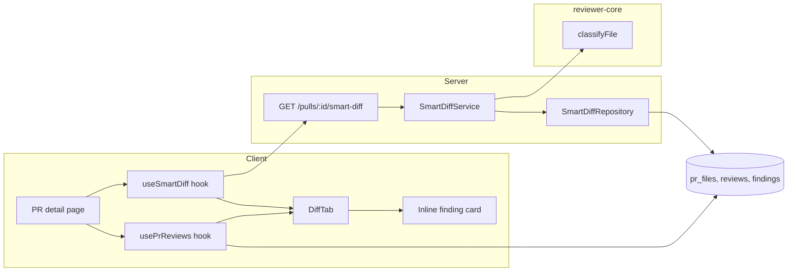

<!-- verified against 58b6366 on 2026-09-26 · sources: server/src/vendor/shared/contracts/brief.ts, server/src/db/schema/reviews.ts, server/src/modules/pulls/routes.ts, client/src/lib/severity.ts, client/src/components/diff-viewer/FileCard/FileCard.tsx, client/src/components/diff-viewer/constants.ts, docs/plans/02-smart-diff.md -->

# 007 — Smart Diff

## Problem

The Files changed tab renders one flat list, in whatever order the diff
arrived in. A generated lock file, a snapshot, a config tweak and the actual
logic change all sit at the same level, so a reviewer scans every file to
find the ones that matter. Once a review has run, nothing in the tab shows
where its findings landed — a reviewer has to cross-reference the Agent
runs/findings tab against the diff by hand, and a finding on a line GitHub's
patch view doesn't render (for example a deleted-only line) has no visible
home at all.

## Scope

- A pure `classifyFile(path): SmartDiffRole` in `@devdigest/reviewer-core`
  that sorts a changed path into one of five roles — `core`, `tests`,
  `wiring`, `docs`, `boilerplate` — with no I/O.
- `GET /pulls/:id/smart-diff`: the PR's files grouped by role, each group
  carrying which files have findings from the latest review.
- A "REVIEWER-ORDERED DIFF" Files changed tab: role groups with sane collapse
  defaults, a file-level and group-level indicator of undismissed findings,
  and a compact inline finding card (modelled on the Agent runs FindingCard)
  rendered under the line it concerns.
- An "Original order" toggle that keeps today's flat list, carrying the same
  dots and inline findings so both views show the same information.
- One "Show/Hide comments" toggle that hides and shows GitHub comment threads
  and inline finding cards together, while every finding marker (file dot,
  group count, line bar and label) stays visible.
- Grouping that works before the first review: files are grouped with no
  findings, and a quiet "review not run yet" line takes the place of the
  finding markers.
- Sticky group headers, and finding markers that refresh as soon as a review
  run finishes, whichever tab is open.

**Not in scope.** An LLM-written `pseudocode_summary` for a file (the field
stays null — no LLM call is made to fill it). Any `split_suggestion` logic
beyond a fixed `too_big: false` / `proposed_splits: []`. Using `classifyFile`
to filter files before prompt assembly. Any change to `FindingCard`, the
Agent runs/findings tab, `usePrReviews`/`useFindingAction`, or the `pr_files`
table (it has no ordering column). Content-based barrel detection — a file
named `index.ts` is always `wiring`, regardless of what it contains. An e2e
flow for this tab.

## Design

### Roles: display order vs. rule evaluation order

The five roles have one order for display and a different order for
matching a path against the rules — the two are not the same list:

| | Order |
|---|---|
| **Display** (group position in the tab) | `core → tests → wiring → docs → boilerplate` |
| **Rule evaluation** (which rule a path is tested against first) | `boilerplate → tests → wiring → docs → core` (fallback) |

A path is matched against each role's rules in evaluation order; the first
rule that matches wins, and `core` is the fallback when nothing else
matches. Directory-based rules match a path **segment at any depth**, not
only at the root — `server/dist/app.js` matches the `dist` segment rule the
same way `dist/app.js` does, because this repo's four packages each nest
their own `dist/`, `.claude/`, `test/`, and similar folders below the root.

The rule table, by role, in evaluation order:

| Role | Matches on |
|---|---|
| **boilerplate** | suffix `.lock`, `.snap`, `.min.js`, `.d.ts` · basename `pnpm-lock.yaml`, `package-lock.json`, `yarn.lock` · substring `.generated.` · segment `dist`, `build`, `__snapshots__` |
| **tests** | suffix `.test.ts`, `.test.tsx`, `.spec.ts` · segment `test`, `tests`, `__tests__`, `e2e` |
| **wiring** | basename `index.ts`, `index.js`, `package.json` · substring `.config.` · prefix+suffix `tsconfig…json`, `docker-compose…yml` · prefix `.eslintrc`, `.env` · segment `.github`, `.claude` |
| **docs** | suffix `.md` · segment `docs` · prefix `README`, `CHANGELOG` · basename `LICENSE` or prefix `LICENSE.` |
| **core** | fallback — everything that matched no rule above |

Three edge cases show why evaluation order matters, since it can disagree
with what the path visually suggests:

- **`__tests__/__snapshots__/x.snap` → `boilerplate`.** Boilerplate is
  evaluated before tests; the `__snapshots__` segment rule fires before the
  `__tests__` segment rule ever gets a chance, so a snapshot file inside a
  test folder is still boilerplate — it's generated output, not a test.
- **`.claude/skills/security/SKILL.md` → `wiring`.** Wiring is evaluated
  before docs; the `.claude` segment rule fires before the `.md` suffix
  rule, so a Markdown file that configures tooling is wiring, not docs.
- **`e2e/README.md` → `tests`.** Tests are evaluated before docs; the `e2e`
  segment rule fires before both the `.md` suffix rule and the `README`
  prefix rule. This is a deliberate, not incidental, choice — a README that
  lives inside an `e2e/` tree still marks that tree as test material to
  review as such.

Two deliberate choices about what is *not* boilerplate:

- **`package.json` → `wiring`.** A lock file is mechanical output, but a
  `package.json` change is a decision — a new dependency, a script, an
  engine bump — that hooks code into the build, so it is reviewed with
  wiring, not skimmed with its lock file.
- **`vendor/` is not a boilerplate rule.** In this repo `*/src/vendor/shared`
  holds the Zod contracts, and contracts change there first; collapsing them
  into a "skim" group would hide exactly the change a reviewer must read.
  Vendored files therefore fall through to their normal rule (usually
  `core`). Hand-written or generated `*.d.ts` declaration files are
  boilerplate.

### `GET /pulls/:id/smart-diff`

Returns a `SmartDiff`: `groups`, each `{ role, files }`, plus a
`split_suggestion`.

- **Groups.** Only roles that have at least one file are present, and they
  appear in display order (`core, tests, wiring, docs, boilerplate`) — an
  empty role is omitted rather than sent empty for the client to hide.
- **Files.** Inside a group, files are sorted by path ascending. `pr_files`
  carries no ordering column of its own, so the server is the only place a
  deterministic order can come from.
- **`finding_lines`.** For each file, the sorted, de-duplicated `start_line`
  values of the **latest `kind='review'` review's** undismissed findings for
  that file — the same "newest `kind='review'`" rule the PR list already
  uses for its score ring. A finding from an older review, from a
  `kind='summary'` review, or one that has been dismissed, contributes
  nothing to `finding_lines`; a dismissed finding still exists and still
  renders (muted) as a card, but drops out of every dot and count.
- **`split_suggestion`.** Kept minimal: `too_big` is always `false`,
  `total_lines` is the sum of `additions + deletions` across every file in
  the PR, and `proposed_splits` is always empty — the deeper "should this PR
  be split" analysis is out of scope.
- An unknown PR id, or a PR outside the caller's workspace, returns 404.

### UI

The Files changed tab shows a "REVIEWER-ORDERED DIFF" header, an
"N files · +A −D" summary, and a **Smart order / Original order** toggle
that defaults to Smart order.

- **Smart order** renders one collapsible group per non-empty role, in
  display order. A group header shows a chevron, a role-coloured square, the
  role's label and a short hint, and on the right — only once the latest
  review has findings — a dot with the count of **files in that group that
  have findings** (`●N`, e.g. two files with five findings between them
  still shows `●2`), followed by "N files". `docs` and `boilerplate` groups
  start collapsed; the other three start open, and a file within an open
  group still respects the existing size-based auto-expand threshold.
- **Original order** renders the PR's flat file list exactly as it does
  today — same order, same dots, same inline findings — so switching the
  toggle changes grouping only, never the underlying information.
- **File dot vs. comment counter.** A file card shows a plain dot next to
  its path when it has any undismissed finding. This is a second, separate
  indicator from the existing comment counter next to the file (the one
  driven by GitHub/GitLab PR comments) — a file can have comments with no
  findings, findings with no comments, or both, and the two counters must
  not be conflated.
- **Inline findings.** Each undismissed finding from the latest review
  renders as an inline card under its diff row. A single-line finding sits
  under `RIGHT:start_line`. A multi-line finding marks every added line in
  `start_line…end_line` and its card sits under the last of them; context
  lines inside the range are not marked (this follows the mockup and is a
  deliberate deviation from anchoring only to `start_line`; group and file
  indicators still count by `start_line`). If the range has no rendered
  added line, the marker and card fall back to `start_line`; if no line of
  the range is rendered, the finding goes to the "outside the shown diff"
  block. The card is the tab's own compact card, not the Agent runs
  FindingCard: a severity icon in a tinted square, the uppercase severity
  word (BLOCKER / WARNING / SUGGESTION), the title and category, then
  "line 61-74 ● 79% conf" (no file path — the file is already known),
  the rationale, a SUGGESTED FIX box and Accept / Dismiss. It is inset like
  a GitHub comment thread and has a 3px severity-coloured left border. It
  has a single close (×) control at the top right and no expand chevron. The × collapses the card into a
  one-line stub (severity badge and title) rather than removing it; clicking
  the stub restores the full card. That row also gets a severity-
  coloured left bar and a right-aligned label pill — outlined in the
  severity colour, lightly tinted, with the severity icon before the word:
  `CRITICAL` → "blocker",
  `WARNING` → "warning", `SUGGESTION` → "suggestion" — the colour comes from
  the existing severity palette, not a new one. A finding whose line isn't
  among the diff's rendered rows (for example, a finding on a deleted-only
  line) is never dropped: it renders instead in a distinct
  "outside the shown diff" block at the bottom of its file. Accepting or
  dismissing a finding updates both its card and every dot/count that
  depended on it. The line's bar and label stay whether the card is
  expanded or collapsed to its stub.
- **One toggle for comments and findings.** The header's "Show/Hide
  comments" button appears when the PR has GitHub comments or the latest
  review has findings, and its count is the sum of both. Hiding removes the
  comment threads (inline and outdated), the inline finding cards and stubs,
  and the "outside the shown diff" block. The file dot, the group's `●N` and
  each line's severity bar and label stay, so the diff stays clean without
  losing where the findings are. There is one state for both: until the user
  toggles, content is shown when the latest review has findings and hidden
  otherwise (a PR with only comments keeps today's hidden-by-default
  behaviour). Posting a comment reveals it.
- **Sticky group headers.** In Smart order a group header stays pinned while
  its files scroll, directly below the PR header and its tabs, never under
  them.
- **Before the first review.** Grouping needs no review: the route
  classifies files by path alone and returns empty `finding_lines`, with no
  LLM call. Until a `kind='review'` review exists, the tab shows a quiet
  "Review not run yet — findings will appear here after Run Review" line. It
  comes from the reviews the page already loads, so the contract gains no
  field.
- **Refresh after a run.** When the PR's last active run finishes, the page
  refetches reviews (and with them the smart-diff grouping) and the run
  history, whichever tab is open. The dots, counts, cards and the
  empty-state line update without a reload.

### Data flow

`useSmartDiff` supplies grouping, order and finding *presence* (dots, `●N`);
`usePrReviews` — already used by the findings tab — supplies the finding
*detail* the inline cards render. Both follow the same "latest
`kind='review'`" rule, so the two views never disagree about which findings
are current.

## Acceptance

- `classifyFile` is importable from `@devdigest/reviewer-core`, does no I/O,
  and classifies `__tests__/__snapshots__/x.snap` → `boilerplate`,
  `.claude/skills/security/SKILL.md` → `wiring`, `e2e/README.md` → `tests`,
  `src/config.ts` → `core`, and `server/pnpm-lock.yaml` → `boilerplate`.
- `SmartDiffRole` is the same five-value enum
  (`core, tests, wiring, docs, boilerplate`) in the server's and the
  client's copy of the shared contract.
- `GET /pulls/:id/smart-diff` returns groups in display order, files sorted
  by path inside each group, `finding_lines` drawn only from the latest
  `kind='review'` review's undismissed findings, and a minimal
  `split_suggestion`; an unknown PR id or a PR outside the caller's
  workspace returns 404.
- The Files changed tab shows the header, the file/±count summary, and a
  Smart/Original toggle defaulting to Smart order; in Smart order, `docs`
  and `boilerplate` start collapsed while the rest start open (per-file
  auto-expand still applies inside them), and a lock file always lands in
  `boilerplate`.
- Once the latest review has findings, a group header shows a dot with the
  count of files in that group carrying findings, and a file card shows a
  plain dot beside its path, distinct from the comment counter — both
  driven only by `finding_lines`.
- Each finding of the latest review renders inline under its line as a
  closable inline card (the tab's own card, see AC21-style design above);
  that line gets a severity-coloured bar and a
  blocker/warning/suggestion label; a finding whose line isn't rendered in
  the diff appears in an "outside the shown diff" block instead of being
  dropped; Accept/Dismiss updates both the dots and the cards.
- Original order shows the same flat file list the tab shows today, carrying
  the same file dots and inline findings as Smart order.
- The Agent runs/findings tab is unaffected, and no existing client, server
  or reviewer-core test regresses.
- Every group label, hint, header, toggle, counter and line label in the tab
  comes from the `prReview.smartDiff` i18n namespace — none is hard-coded in
  JSX.
- On a real PR that contains a lock file, application code, a test file, and
  a config or barrel file, the groups, collapse defaults, dots and inline
  findings visibly match the checks above after a review has run (manual —
  needs sign-off; cannot be automated end-to-end).
- A single "Show/Hide comments" toggle, visible when there are comments or
  findings, hides and shows comments and inline finding content together,
  while file dots, group counts and line bars and labels stay. Its label
  comes from i18n.
- For a PR with no reviews, the route returns grouped files with empty
  `finding_lines` and makes no LLM call (integration test).
- The × on an inline finding collapses it to a severity + title stub;
  clicking the stub re-expands it.
- Smart order group headers stay pinned below the PR header while scrolling.
- Before any review has run, the tab shows the "review not run yet" line; it
  disappears once a review exists.
- After Run review finishes, the markers and cards update without a reload,
  even when Files changed was opened mid-run.
- `package.json` is classified `wiring` and `*.d.ts` files are classified
  `boilerplate`.
- The inline card matches the mockup: severity icon + uppercase word,
  title, category, "line X-Y" with confidence, rationale, suggested fix,
  Accept / Dismiss, one × and no chevron, inset from the code with a
  severity left border; the line label is an outlined pill with an icon.
- A multi-line finding marks every added line in its range with the bar and
  label, and shows its card once, under the last of them.

## Risks

- With only the newest `kind='review'` review feeding dots and cards, a PR
  reviewed by several agents shows findings from the most recent agent's
  review only — the others are not surfaced in this tab.
- Without a forge token, `GET /pulls/:id` serves `pr_files` with no
  guaranteed order, so Original order is not guaranteed to match the forge's
  own file order when running offline; this is pre-existing and unrelated
  to Smart Diff.
- A directory literally named `build/` or `dist/` for reasons other than
  build output is still classified `boilerplate` — the rule has no way to
  tell the two apart from the path alone.
- Until the user toggles, comments are shown on a PR whose latest review has
  findings. That changes the old always-hidden default for such PRs.
- A run that starts and finishes between two active-run polls (4 s) is never
  seen as "active", so the page does not refresh from that signal. The
  mutation's own invalidation at start and the Agent runs tab's completion
  handler still cover the common path.
